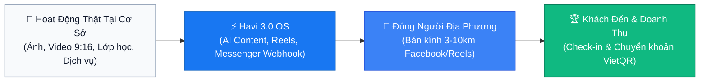
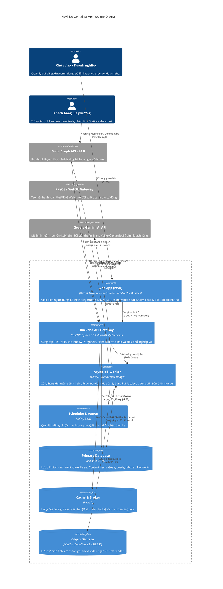
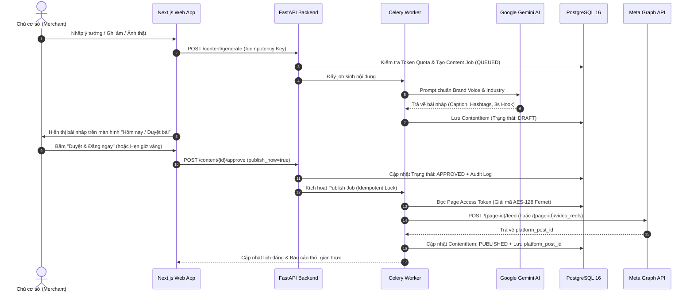
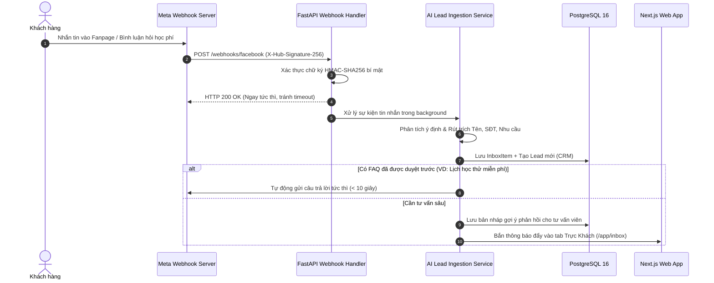
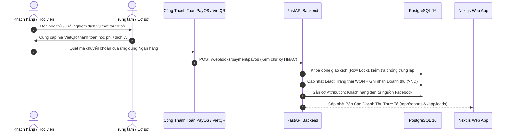

# 🏛️ Havi 3.0 System Architecture & Engineering Blueprint

> **Team Persona & Standards**: MIT Distributed Systems Rigor × Stanford Product & HCI Excellence.  
> **Core Tenet**: "Làm xong $\rightarrow$ Gắn bộ kiểm thử thật (Integration/Unit Tests) đạt 100% Pass $\rightarrow$ Mới phát hành."

---

## 1. Executive Summary & Product Positioning

**Havi 3.0** is the **Local Customer-to-Visit OS** (Hệ điều hành biến hoạt động thật tại cơ sở thành khách đến và doanh thu được xác minh).



* **North Star Metric**: Số lượt khách đến đã xác minh mỗi tuần trên mỗi doanh nghiệp hoạt động (*Verified Visits / active business / week*).
* **Health Metric**: Tốc độ phản hồi tin nhắn khách hàng qua Messenger < 10 giây.
* **Platform Priority Strategy**: Tập trung tối ưu hoàn hảo 100% trên **Facebook (Fanpage, Reels, Messenger)** $\rightarrow$ Mở rộng sang Google Business Profile $\rightarrow$ YouTube Shorts $\rightarrow$ TikTok.

---

## 2. High-Level C4 Container Architecture

Havi được thiết kế theo mô hình **Modular Monolith với Clean / Hexagonal Domain-Driven Design (DDD)**:



---

## 3. Core Business Dataflow & Sequence Diagrams

### Flow 1: Facebook Content Creation & Human-in-the-Loop Publishing
> **Bất biến**: Không có bài nào được đăng lên Facebook nếu chưa có hành động duyệt rõ ràng từ chủ cơ sở.



---

### Flow 2: Facebook Messenger Webhook & Instant Lead Capture (<10s)
> **Bất biến**: Webhook phải xác thực chữ ký SHA-256 HMAC; Lead và số điện thoại phải được trích xuất an toàn.



---

### Flow 3: Verified Local Visits & Closed-Loop Revenue Attribution
> **Bất biến**: Doanh thu chỉ được xác nhận khi có giao dịch thanh toán thật (VietQR) hoặc check-in tại cơ sở.



---

## 4. Codebase Layout & Hexagonal DDD Layers

### Backend Directory Architecture (`apps/backend/`)
```text
apps/backend/
├── api/                         # Presentation Layer (FastAPI Routers, Dependency Injection)
│   ├── deps.py                  # Database Session, Auth, Workspace Context
│   ├── main.py                  # FastAPI Application Entrypoint & Middleware
│   ├── rate_limit.py            # Workspace Rate Limiting Policies
│   └── routers/                 # Thin HTTP Routers (content, inbox, leads, billing, webhooks...)
├── application/                 # Application Services (Use Cases & Transaction Boundaries)
│   └── services/                # ApprovalService, PublishService, LeadService, VideoRenderService...
├── domain/                      # Core Domain Layer (Pure Python, Zero Framework Dependencies)
│   ├── models/                  # Domain Entities (ContentItem, Lead, Goal, Workspace, User...)
│   ├── policies/                # Domain Invariants, Quotas, Intent Parsing, Video Safe-Zones
│   └── ports/                   # Repository & Provider Abstract Interfaces
├── adapters/                    # Infrastructure Adapters Layer
│   ├── persistence/             # SQLAlchemy Repositories (ContentRepository, LeadRepository...)
│   ├── social/                  # FacebookAdapter (Meta Graph API v20.0), Zalo, TikTok
│   ├── llm/                     # GeminiAdapter (LLM Client)
│   ├── storage/                 # S3/MinIO Storage Adapter
│   └── payment/                 # PayOS / VietQR Adapter
├── worker/                      # Celery Async Execution Layer
│   ├── celery_app.py            # Celery Configuration & Redis Broker Connection
│   └── tasks.py                 # Async Background Tasks (Generate, Publish, Render)
├── scheduler/                   # Celery Beat Scheduled Tasks (Dispatch due posts)
├── migrations/                  # Alembic Database Migrations
└── tests/                       # 100% Deterministic Test Suite (505 Pytest tests)
```

### Frontend Directory Architecture (`apps/web/`)
```text
apps/web/
├── src/
│   ├── app/                     # Next.js 16 App Router Pages & Layouts
│   │   ├── (app)/app/           # Authenticated App Shell Pages (/today, /content, /inbox, /reports...)
│   │   ├── (marketing)/         # Public Landing Page, Pricing & Legal Pages
│   │   └── globals.css          # Design System Tokens & Typography
│   ├── components/              # Shared UI Primitives & App Shell Components
│   │   ├── app-shell/           # Header, Sidebar, User Profile & Navigation
│   │   └── ui/                  # Button, Toast, State Views, Modal, OTP Input
│   ├── features/                # Feature Modules (Isolated Business Capabilities)
│   │   ├── today/               # Daily Action Center & Priority Tasks
│   │   ├── content-creation/    # AI Studio, Video Teleprompter & Caption Editor
│   │   ├── inbox/               # Messenger Instant Care & Auto FAQ Responses
│   │   ├── leads/               # CRM Lead Pipeline & Verified Visits
│   │   ├── reports/             # Facebook Performance Analytics & Revenue Attribution
│   │   ├── roadmap/             # Living Growth Roadmap & Goal Generator
│   │   ├── billing/             # Subscription Plans & Token Quotas
│   │   └── onboarding/          # Business Truth Pack Initializer
│   └── lib/                     # Client Infrastructure
│       ├── api-client/          # Auto-generated Type-Safe OpenAPI Client & Schema
│       ├── auth/                # JWT Token Store & Route Guards
│       └── i18n/                # Vietnamese / English Localization Context
└── tests/                       # Vitest Component & Integration Tests (178 tests)
```

---

## 5. Security Guardrails & Invariants

1. **Bảo Mật Khóa Truy Cập Mạng Xã Hội**: Mọi Page Access Token lưu trong cơ sở dữ liệu đều được mã hóa đối xứng qua thuật toán **AES-128 Fernet**. Token thô tuyệt đối không bao giờ được serialize ra ngoài REST API response.
2. **Xác Thực Mật Khẩu**: Sử dụng chuẩn công nghiệp **Argon2id** với thông số bộ nhớ nghiêm ngặt, chống brute-force và rainbow table.
3. **Phân Lập Đa Doanh Nghiệp (Multi-Tenant Isolation)**: Mọi câu truy vấn Database bắt buộc phải lọc theo `workspace_id`. Không có endpoint nào cho phép truy cập chéo dữ liệu tiệm khác.
4. **Chống Đăng Lặp (Idempotency)**: Đảm bảo bởi 2 lớp: Ràng buộc duy nhất `unique_post_fingerprint` ở mức PostgreSQL và khóa phân tán `aioredis` tại `PublishService`.

---

## 6. Developer Quickstart & Testing Mandate

### Chạy Môi Trường Phát Triển:
```bash
npm run dev
# Tự động khởi chạy:
# - Frontend: http://localhost:3000
# - Backend API: http://localhost:8000 (Swagger docs tại /docs)
# - PostgreSQL 16, Redis 7 & MinIO qua Docker
```

### Chạy Bộ Kiểm Thử Bắt Buộc (Mandatory Test Suite):
```bash
# 1. Kiểm tra Frontend Vitest (32 files, 178 tests)
npm --prefix apps/web test

# 2. Kiểm tra Next.js Production Build
npm --prefix apps/web run build

# 3. Kiểm tra Backend Pytest (505 tests)
uv run --directory apps/backend pytest
```
