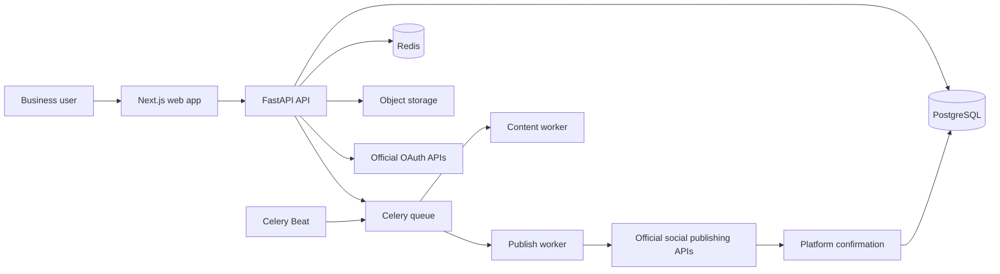
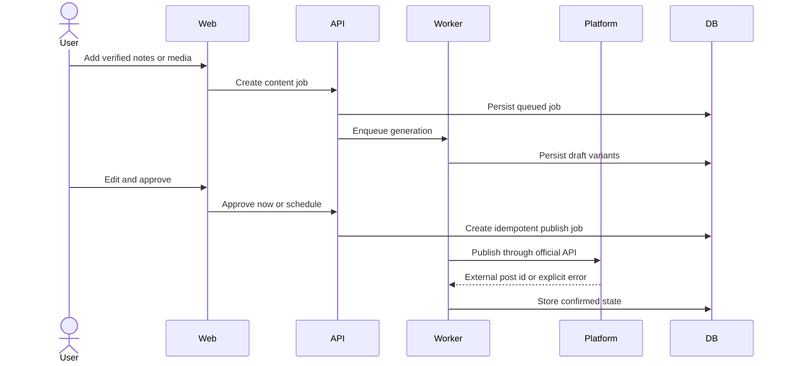
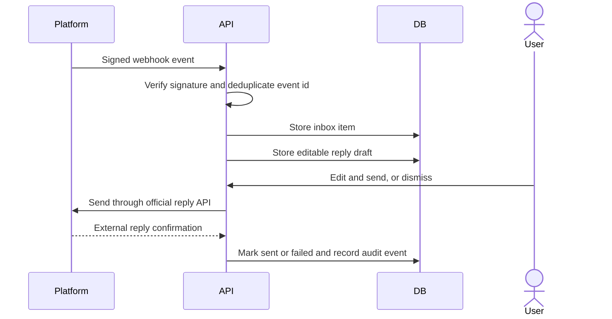

# Havi Architecture

Havi is a multi-tenant control plane for business social media operations. It
centralizes channel connections, reusable media, content, approvals, publishing,
conversations, team permissions, audit history, and operational reports.

## Product boundary

Havi owns social operations. It does not own business outcomes.

- No goal or roadmap operating system.
- No sales pipeline, POS, inventory, delivery, or full CRM.
- No video editor. Havi accepts finished media and validates it for publishing.
- No direct ad creation, budget changes, or media-spend custody.
- No promises about customers, growth, conversion, or revenue.
- Havi is positioned as an AI secretary, but current AI capability is bounded:
  it drafts content while deterministic policies prioritize work. A person
  reviews content and non-FAQ replies.

## Runtime topology



The API owns authentication, tenant scope, secrets, state transitions, and the
OpenAPI contract. Workers perform slow generation and publishing work. Beat
only schedules due work; it does not call providers inline.

## Domain modules

| Module | Responsibility |
|---|---|
| Organizations and workspaces | Multi-brand grouping and tenant isolation |
| Connections | OAuth lifecycle, encrypted tokens, health and reauthorization |
| Media | Direct upload tickets, metadata, reuse, video constraints |
| Content | Drafts, versions, review, approval and channel adaptation |
| Calendar and publishing | Schedule, idempotent jobs, retries and reconciliation |
| Inbox | Messages, comments, reviews, editable reply drafts and explicit send/dismiss |
| Team and permissions | Owner, marketer, reviewer and support capabilities |
| Audit and reports | Truthful activity history and operational counts |
| Billing | SaaS subscription and invoice state |

## Critical flows

### Draft to publish



`published` means the provider returned a usable external identifier. An
ambiguous timeout becomes `pending_reconciliation` and is not retried blindly.

### Conversation handling



Only an exact-match FAQ explicitly approved in the brand profile may be sent
without a button press. Missing approval fails closed.

## Security and reliability invariants

- Every business query includes `workspace_id`; authorization is checked again
  at the API boundary.
- Passwords use Argon2id. Provider tokens are encrypted at rest.
- Webhooks use provider signatures and constant-time comparison.
- Publishing uses database-backed idempotency and row locking.
- Fake providers and mock models are local-only and rejected outside local.
- External success is never inferred from an internal queue state.
- User-visible automation is auditable: actor, action, time and result.

## Source layout

```text
apps/web/                 Next.js routes, feature screens and API client
apps/backend/api/         HTTP composition and routers
apps/backend/application/ Use cases and state transitions
apps/backend/domain/      Models, policies and provider ports
apps/backend/adapters/    PostgreSQL, OAuth, storage and publisher adapters
apps/backend/worker/      Content and publish workers
apps/backend/scheduler/   Due-work scheduling
apps/backend/migrations/  Alembic schema history
```

## Release rule

No feature is released before relevant unit/integration tests pass. Contract
changes require regenerating the TypeScript OpenAPI schema and validating both
backend and frontend suites.
