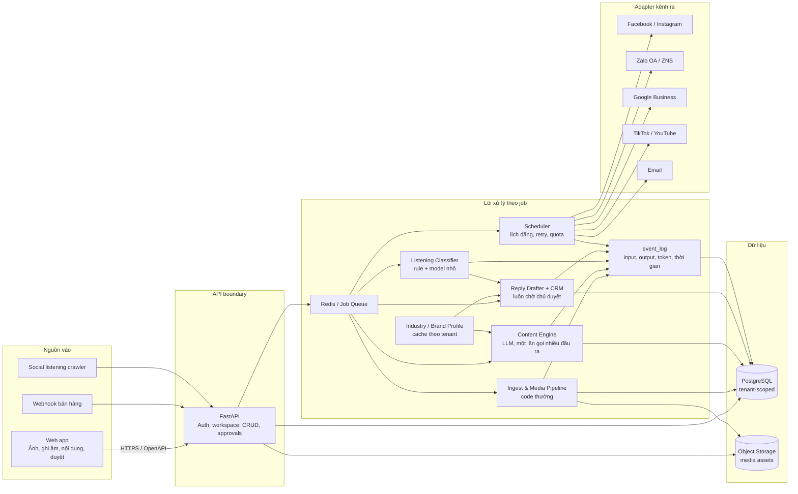
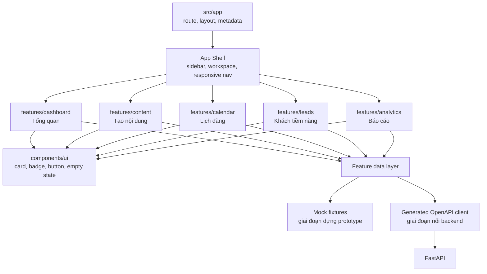
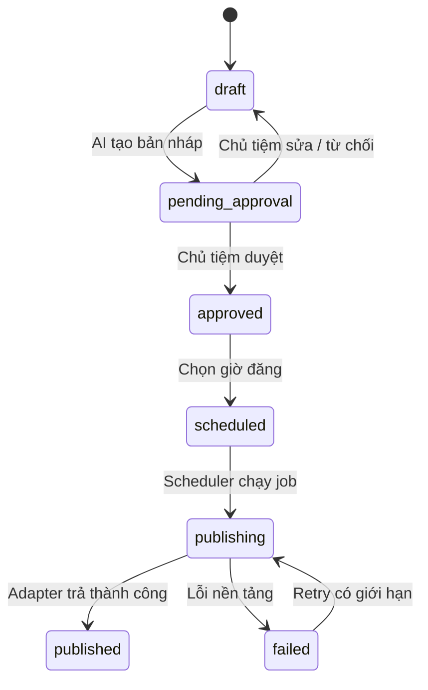

# Havi System Architecture

Tài liệu này là sơ đồ triển khai chuẩn cho MVP, được rút ra từ prototype
`Havi - Kiến Trúc Hệ Thống.dc.html`, `REPOSITORY_STRATEGY.md` và
`TECHNICAL_SPEC.md`.

## 1. Kiến trúc tổng thể



## 2. Kiến trúc frontend

Frontend dùng Next.js App Router. Route chỉ ghép màn hình; business state và API
được tách theo feature để khi nối backend không phải sửa lại phần trình bày.



### Cấu trúc mục tiêu

```text
apps/web/src/
├── app/                         # Routing, layouts, metadata
├── components/
│   ├── app-shell/               # Sidebar và workspace switcher
│   └── ui/                      # Primitive dùng chung
├── features/
│   ├── dashboard/
│   ├── content/
│   ├── calendar/
│   ├── leads/
│   └── analytics/
├── lib/
│   ├── api-client/              # Chỉ gọi backend qua HTTP
│   └── config/
└── styles/                      # Design tokens toàn cục
```

## 3. Luồng trạng thái nội dung



Backend là nguồn sự thật của state machine. Frontend chỉ hiển thị trạng thái và
gửi action; không giữ token nền tảng, prompt production hoặc secret.

## 4. Thứ tự triển khai frontend

1. Khóa design tokens và App Shell theo prototype.
2. Dựng từng màn bằng fixture tĩnh, bắt đầu từ `Tổng quan`.
3. Bổ sung interaction đúng prototype trong từng feature.
4. Sinh TypeScript client từ OpenAPI rồi thay fixture bằng API data.
5. Thêm loading, empty, error và permission states trước khi tích hợp end-to-end.

