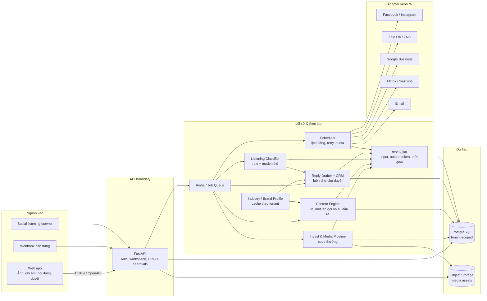
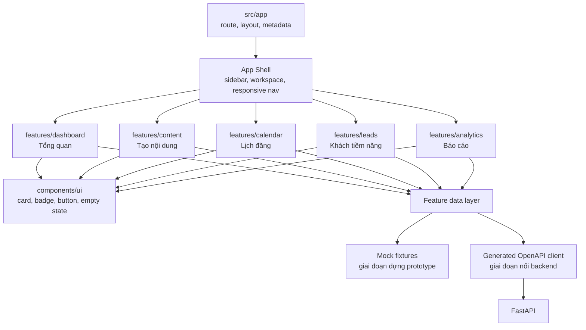
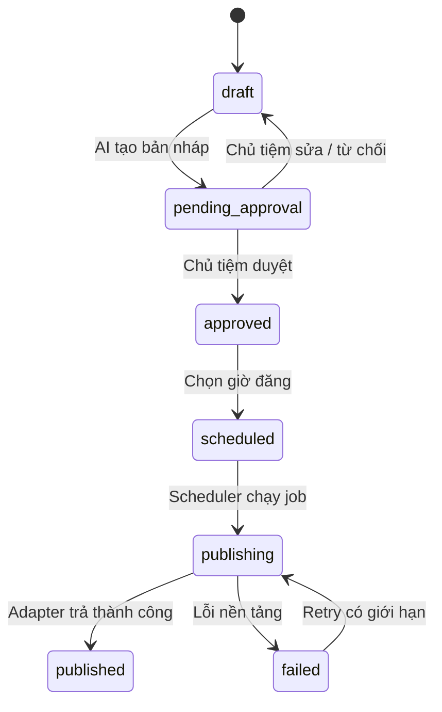
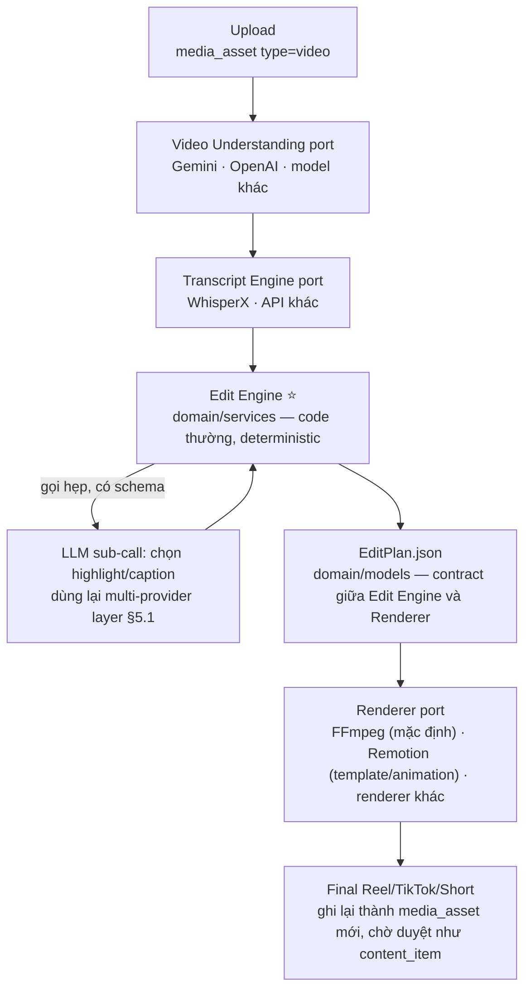

# Havi System Architecture

Tài liệu này là sơ đồ triển khai chuẩn cho MVP, được rút ra từ prototype
`Havi - Kiến Trúc Hệ Thống.dc.html`, `REPOSITORY_STRATEGY.md` và
`TECHNICAL_SPEC.md`.

## 0. Nguyên tắc kỹ thuật nền tảng

Havi dùng tư duy kỹ thuật kiểu MIT: bắt đầu từ invariant và interface đơn giản,
phân rã hệ thống thành module có thể lý giải/test độc lập, đo trước khi scale.
Đây là định hướng engineering của dự án, không phải tên một tiêu chuẩn MIT chính thức.

### Mười nguyên tắc bắt buộc

1. **Simple first:** chọn modular monolith, một PostgreSQL và một queue trước;
   không thêm microservice, event bus hoặc database mới khi chưa có số liệu chứng minh.
2. **Ranh giới rõ:** mỗi module có input, output, data ownership và failure modes
   được mô tả; module khác chỉ dùng public interface.
3. **Dependency một chiều:** entrypoint phụ thuộc application, application phụ
   thuộc domain/ports, adapter triển khai ports; domain không import framework/provider.
4. **Single source of truth:** PostgreSQL sở hữu business state; Redis chỉ giữ
   queue/cache/lock ngắn hạn; calendar và dashboard là projection, không tạo state song song.
5. **Invariant trước workflow:** approval, tenant isolation, quota và idempotency
   được enforce trong domain/service, không chỉ dựa vào UI hoặc convention.
6. **Deterministic và idempotent:** cùng một command/idempotency key không tạo
   hai kết quả bên ngoài; retry phải an toàn và có giới hạn.
7. **Failure isolation:** lỗi một job/adapter không kéo sập request khác; lỗi được
   phân loại temporary, auth-permission hoặc validation-permanent.
8. **Observability là feature:** request/job có correlation ID, structured log,
   state transition, latency, token/cost và error reason đủ để debug không đọc mò DB.
9. **Scale theo bottleneck:** API stateless, worker scale theo queue depth, media
   nằm ở object storage; chỉ tách service khi ownership/load/deploy cadence thật sự khác.
10. **Test contract và invariant:** ưu tiên tests ở ranh giới module, state machine,
    tenant isolation và adapter contract hơn test chi tiết implementation dễ vỡ.

### Dependency rules

Frontend:

```text
app/routes
    ↓
features
    ↓
components/ui + lib/api-client
```

- `app/` chỉ routing, layout, metadata và composition.
- Feature không import private code của feature khác; chia sẻ qua UI primitive,
  public feature contract hoặc route-level composition.
- UI component không gọi HTTP trực tiếp; feature data layer dùng generated API client.
- Fixture và API implementation cùng thỏa một feature-facing interface để thay thế rõ ràng.

Backend:

```text
api / worker / scheduler          entrypoints
              ↓
application services             orchestration + transaction boundary
              ↓
domain + ports                   rules, state machine, interfaces
              ↑
repositories / provider adapters PostgreSQL, Redis, LLM, Facebook, storage
```

- Domain không import FastAPI, Celery, SQLAlchemy, Redis SDK, OpenAI SDK hoặc platform SDK.
- API, worker và scheduler gọi cùng application service; không nhân đôi business rule.
- Repository/adapter chỉ chuyển đổi I/O; không tự quyết định approval/quota/state transition.
- Event chỉ dùng ở async/external boundary; không thay function call nội bộ bằng event vô lý.
- Mỗi thay đổi schema đi qua migration; không sửa production database thủ công.

Backend target structure:

```text
apps/backend/
├── api/                         # FastAPI entrypoint + thin routers
├── worker/                      # Celery entrypoint, gọi application services
├── scheduler/                   # Beat entrypoint, chỉ phát command đến hạn
├── application/
│   ├── services/                # Use cases + transaction boundaries
│   └── dto/                     # Input/output nội bộ của use case
├── domain/
│   ├── models/                  # Entity/value object thuần Python
│   ├── policies/                # Approval, quota, scheduling rules
│   ├── services/                # edit_engine.py (§5.3) và service thuần khác
│   └── ports/                   # Repository/provider interfaces
├── adapters/
│   ├── persistence/             # PostgreSQL repositories
│   ├── queue/                   # Redis/Celery implementation
│   ├── storage/                 # S3-compatible implementation
│   ├── llm/                     # Text model provider implementation (§5.2)
│   ├── media/                   # Video/image pipeline provider adapters (§5.3, P1/P2)
│   │   ├── video_understanding/ # Gemini, OpenAI, model khác
│   │   ├── transcription/       # WhisperX, API khác
│   │   └── renderer/            # FFmpeg, Remotion, renderer khác
│   └── channels/                # Facebook, Zalo, Google adapters
├── migrations/                  # Alembic, versioned schema only
└── tests/                       # domain, contract, integration, E2E
```

`core/` hiện tại là scaffold chuyển tiếp. Khi triển khai persistence, code trong
`core/` được tách dần vào `domain/` và `application/`; không cần big-bang rewrite.

### Quy tắc chống over-engineering

- Không tạo abstraction trước khi có ít nhất hai implementation hoặc một boundary bên ngoài rõ.
- Không tạo shared package chứa business logic giữa frontend và backend.
- Không cache dữ liệu chưa đo là chậm; mọi cache phải có owner và invalidation rule.
- Không swallow exception hoặc retry vô hạn.
- Không thêm background job nếu request đồng bộ đơn giản, nhanh và an toàn hơn.
- Mọi ngoại lệ dependency rule phải có ADR ngắn ghi lý do, trade-off và ngày xem lại.

## 1. Kiến trúc tổng thể



## 2. Kiến trúc frontend

Frontend dùng Next.js App Router. Route chỉ ghép màn hình; business state và API
được tách theo feature để khi nối backend không phải sửa lại phần trình bày.



### Cấu trúc mục tiêu

```text
apps/web/src/
├── app/                         # Routing, layouts, metadata
├── components/
│   ├── app-shell/               # Sidebar và workspace switcher
│   └── ui/                      # Primitive dùng chung
├── features/
│   ├── dashboard/
│   ├── content/
│   ├── calendar/
│   ├── leads/
│   └── analytics/
├── lib/
│   ├── api-client/              # Chỉ gọi backend qua HTTP
│   └── config/
└── styles/                      # Design tokens toàn cục
```

## 3. Luồng trạng thái nội dung



Backend là nguồn sự thật của state machine. Frontend chỉ hiển thị trạng thái và
gửi action; không giữ token nền tảng, prompt production hoặc secret.

## 4. Thứ tự triển khai frontend

1. Khóa design tokens và App Shell theo prototype.
2. Dựng từng màn bằng fixture tĩnh, bắt đầu từ `Tổng quan`.
3. Bổ sung interaction đúng prototype trong từng feature.
4. Sinh TypeScript client từ OpenAPI rồi thay fixture bằng API data.
5. Thêm loading, empty, error và permission states trước khi tích hợp end-to-end.

## 5. Multi-provider AI layer

> Trạng thái: **thiết kế, chưa code.** Ghi lại ở đây để không mất quyết định giữa
> các buổi làm việc. Việc hiện thực đi theo đúng phân kỳ ROADMAP.md §4 — Content
> Engine text là P0, pipeline video/hình ảnh (§5.3 dưới) là P1/P2.

### 5.1 Vì sao nhiều provider

Không phụ thuộc một provider duy nhất — một lần Anthropic/Gemini/OpenAI sập hoặc
đổi giá không được phép làm tê liệt Content Engine. `adapters/llm/` implement
`LLMProviderPort` (domain interface, không đổi theo provider) với 3 adapter:
**Gemini** (ưu tiên/mặc định), **Anthropic**, **OpenAI**. Domain chỉ biết interface,
không import SDK provider nào trực tiếp (đúng nguyên tắc #3 ở §0).

Một `ProviderRouter` (domain policy, code thường — không phải LLM) quyết định thử
provider nào trước, theo đúng thứ tự ba lý do đã chốt:

1. **Outage/lỗi/timeout** — provider đang gọi trả lỗi/rate-limit/timeout → thử
   provider kế tiếp trong danh sách cho cùng request, có giới hạn số lần thử.
2. **Cost routing** — mỗi workspace/gói giá có thể map sang danh sách provider ưu
   tiên khác nhau (gói rẻ ưu tiên provider rẻ hơn).
3. **Chất lượng output không đạt** — output không qua schema validation hoặc banned-claims
   validation → thử lại bằng provider khác thay vì retry cùng provider với cùng prompt.

Mỗi lần chuyển provider phải ghi vào `event_log` (provider đã thử, lý do chuyển,
provider cuối cùng phục vụ) — nối tiếp cơ chế `tokens_in/out` đã có trong `EventLogEntry`.

### 5.2 Áp dụng theo phễu bậc thang (không phải mọi bước đều gọi model)

Giữ nguyên phễu tiết kiệm token đã có trong `worker/tasks.py` — multi-provider chỉ
chen vào những bậc thật sự cần model, không áp cho bậc rule-based:

```text
100% input --> rule/keyword (0 token, code thường)
   --> ~5% cần hiểu ngữ nghĩa --> model rẻ (1 provider, không cần multi-provider)
      --> ~1% cần model mạnh xử lý phức tạp --> multi-provider layer (Gemini ưu tiên, fallback Anthropic/OpenAI)
```

Content Engine (sinh multi-channel draft, structured output) là nơi multi-provider
áp dụng đầy đủ nhất vì đây là bậc tốn token nhất và chất lượng ảnh hưởng trực tiếp
tới draft chủ tiệm thấy. Các bậc rẻ hơn (`classify_listening_item`) vẫn dùng 1
provider cố định cho đơn giản, trừ khi có số liệu cho thấy cần đổi.

### 5.3 Pipeline video & hình ảnh (P1/P2 — Content Studio)

Mở rộng cho input là video hoặc khi kênh đích cần video dựng thật (Reels/TikTok/
YouTube), không chỉ script như Content Engine hiện tại. Mỗi bậc là một port riêng,
đa-implementation từ đầu vì bản chất đã multi-provider:



Vai trò từng khối:

- **Video Understanding port** — nhận video thô, trả về tín hiệu cấu trúc (scene,
  đối tượng, khoảnh khắc nổi bật, chất lượng khung hình). Nhiều implementation
  (Gemini/OpenAI/khác) đứng sau cùng `LLMProviderPort`-style interface, dùng lại
  `ProviderRouter` ở §5.1.
- **Transcript Engine port** — audio → transcript có timestamp. WhisperX là
  implementation mặc định (tự host được, không phụ thuộc API ngoài); "API khác"
  là fallback khi cần.
- **Edit Engine (⭐ phần cốt lõi, không phải LLM)** — domain logic thuần
  (`domain/services/edit_engine.py`), **không gọi provider trực tiếp**. Nhận output
  của hai port trên, áp rule xác định (độ dài mục tiêu theo kênh, thứ tự hook-đầu,
  đồng bộ caption, cắt khoảng lặng) để ghép thành `EditPlan.json`. Khi một quyết
  định thật sự cần hiểu ngữ nghĩa (ví dụ chọn 3 giây "hook" hay nhất trong nhiều
  lựa chọn ngang nhau về rule), Edit Engine gọi một **sub-call LLM hẹp, có schema
  đầu ra rõ** qua multi-provider layer §5.1 — không giao toàn bộ việc sinh
  `EditPlan.json` cho một lần gọi LLM lớn. Lý do chọn hướng này: giữ pipeline
  deterministic/idempotent (nguyên tắc #6 ở §0), auditable, và không đội chi phí
  token lên toàn bộ video dài.
- **EditPlan.json** — contract giữa Edit Engine và Renderer, là domain model có
  schema (giống `ContentItem`/`ContentJob` hiện tại), không phải free-form JSON từ
  LLM. Ví dụ hình dạng:

  ```json
  {
    "source_media_id": "uuid",
    "target_channel": "reels",
    "duration_target_seconds": 20,
    "clips": [
      { "start_ms": 0, "end_ms": 3200, "reason": "hook" },
      { "start_ms": 15000, "end_ms": 18500, "reason": "highlight" }
    ],
    "captions": [{ "start_ms": 0, "end_ms": 3200, "text": "..." }],
    "render_target": "ffmpeg"
  }
  ```

- **Renderer port** — nhận `EditPlan.json`, xuất video cuối. FFmpeg là mặc định
  (chạy được on-prem/worker, không phụ thuộc SaaS); Remotion dùng khi cần
  animation/template đẹp hơn FFmpeg thuần làm được. Output ghi lại thành
  `media_asset` mới, đi qua đúng approval flow như `content_item` — không tự đăng.

Ghi chú phạm vi và rủi ro:

- **Chưa nằm trong pilot P0.** ROADMAP.md §4 đã chốt P0 chỉ ảnh+text, video để
  P1/P2 (TikTok/YouTube adapters). Việc ghi thiết kế ở đây không đổi thứ tự đó.
- **Chi phí cao hơn hẳn text.** Video Understanding + transcription + render
  compute đều tốn hơn nhiều so với Content Engine text — khi hiện thực phải có
  quota/threshold riêng cho pipeline này trong `event_log`, không dùng chung ngân
  sách token với Content Engine.
- **Renderer là compute-heavy, không phải job nhanh** — khi hiện thực cần chạy
  trên worker riêng hoặc hàng đợi riêng (đúng nguyên tắc #9 ở §0: scale theo
  bottleneck), không chặn queue của content job thông thường.
