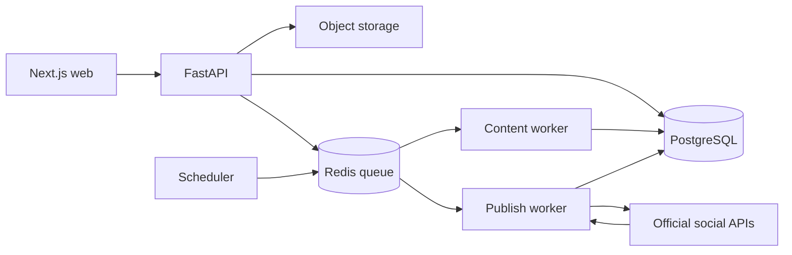

# Havi System Architecture

Havi uses a modular monolith with explicit process boundaries. PostgreSQL is the
source of truth, Redis carries queued work, object storage holds media, and all
social access goes through official provider APIs.

## Dependency direction

```text
api / worker / scheduler
          ↓
application services
          ↓
domain rules and ports
          ↑
persistence and provider adapters
```

Frontend routes compose feature screens. Screens use the generated OpenAPI
client and shared UI primitives; they do not own provider secrets or duplicate
backend state machines.

## Processes



- API: auth, tenant scope, CRUD, approvals, connections and webhooks.
- Content worker: optional AI-assisted drafting from user-provided context.
- Publish worker: idempotent provider calls and external reconciliation.
- Scheduler: enqueues due work; it never performs slow provider calls inline.

## Frontend features

```text
dashboard       actionable channel/content/conversation health
media           reusable source assets
content         draft, edit, review and approve
calendar        schedule and publish status
inbox           messages, comments, reviews and explicit replies
connections     OAuth lifecycle and channel health
team            workspace roles and membership
activity        auditable action history
reports         concise publishing and conversation counts
billing         SaaS plan and invoices
```

## Core invariants

1. Every business query is scoped by `workspace_id`.
2. Content is reviewed before publication.
3. Non-FAQ replies require a person to send them.
4. External success requires provider confirmation.
5. Duplicate webhooks and publish commands are idempotent.
6. Ambiguous publish outcomes stop and enter reconciliation.
7. Fake providers and mock models are local-only.
8. Actions and failures are traceable in the audit log.

## Scope boundary

Havi manages social operations. It does not implement business goals, sales
pipelines, POS, inventory, delivery, full CRM, video editing or direct ad spend.
AI is an optional utility inside the workflow, not an autonomous marketer.

For state models and API routes, see [TECHNICAL_SPEC.md](TECHNICAL_SPEC.md). For
the product boundary and channel sequence, see
[ROADMAP.md](../product/ROADMAP.md).
