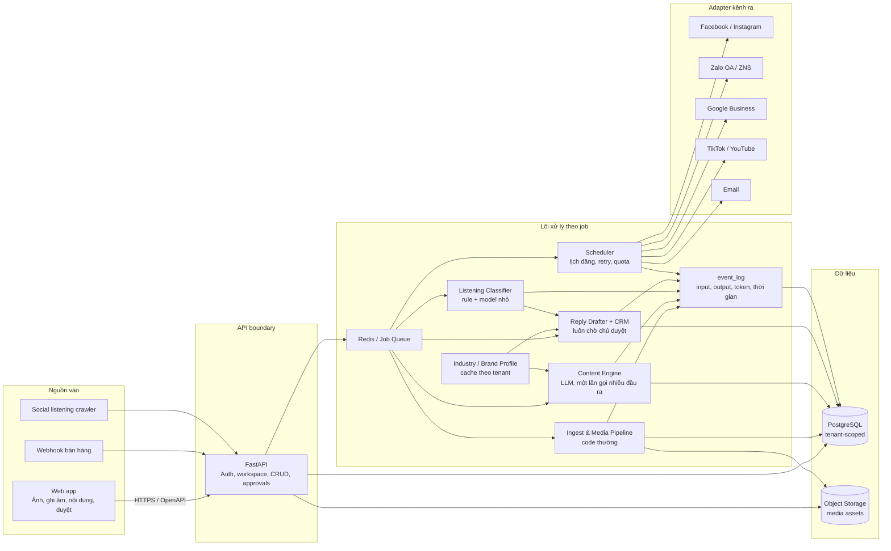
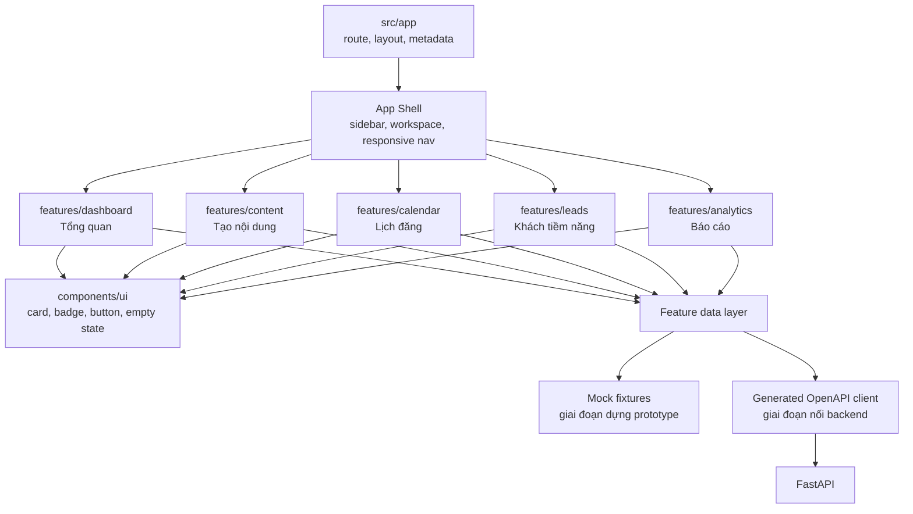
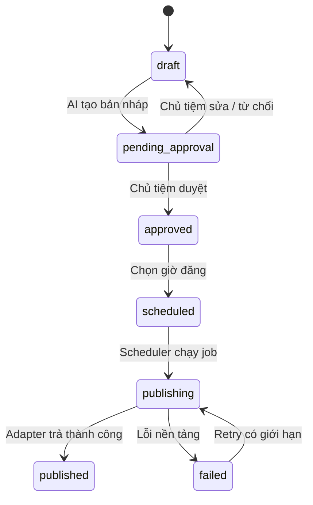

# Havi System Architecture

Tài liệu này là sơ đồ triển khai chuẩn cho MVP, được rút ra từ prototype
`Havi - Kiến Trúc Hệ Thống.dc.html`, `REPOSITORY_STRATEGY.md` và
`TECHNICAL_SPEC.md`.

## 0. Nguyên tắc kỹ thuật nền tảng

Havi dùng tư duy kỹ thuật kiểu MIT: bắt đầu từ invariant và interface đơn giản,
phân rã hệ thống thành module có thể lý giải/test độc lập, đo trước khi scale.
Đây là định hướng engineering của dự án, không phải tên một tiêu chuẩn MIT chính thức.

### Mười nguyên tắc bắt buộc

1. **Simple first:** chọn modular monolith, một PostgreSQL và một queue trước;
   không thêm microservice, event bus hoặc database mới khi chưa có số liệu chứng minh.
2. **Ranh giới rõ:** mỗi module có input, output, data ownership và failure modes
   được mô tả; module khác chỉ dùng public interface.
3. **Dependency một chiều:** entrypoint phụ thuộc application, application phụ
   thuộc domain/ports, adapter triển khai ports; domain không import framework/provider.
4. **Single source of truth:** PostgreSQL sở hữu business state; Redis chỉ giữ
   queue/cache/lock ngắn hạn; calendar và dashboard là projection, không tạo state song song.
5. **Invariant trước workflow:** approval, tenant isolation, quota và idempotency
   được enforce trong domain/service, không chỉ dựa vào UI hoặc convention.
6. **Deterministic và idempotent:** cùng một command/idempotency key không tạo
   hai kết quả bên ngoài; retry phải an toàn và có giới hạn.
7. **Failure isolation:** lỗi một job/adapter không kéo sập request khác; lỗi được
   phân loại temporary, auth-permission hoặc validation-permanent.
8. **Observability là feature:** request/job có correlation ID, structured log,
   state transition, latency, token/cost và error reason đủ để debug không đọc mò DB.
9. **Scale theo bottleneck:** API stateless, worker scale theo queue depth, media
   nằm ở object storage; chỉ tách service khi ownership/load/deploy cadence thật sự khác.
10. **Test contract và invariant:** ưu tiên tests ở ranh giới module, state machine,
    tenant isolation và adapter contract hơn test chi tiết implementation dễ vỡ.

### Dependency rules

Frontend:

```text
app/routes
    ↓
features
    ↓
components/ui + lib/api-client
```

- `app/` chỉ routing, layout, metadata và composition.
- Feature không import private code của feature khác; chia sẻ qua UI primitive,
  public feature contract hoặc route-level composition.
- UI component không gọi HTTP trực tiếp; feature data layer dùng generated API client.
- Fixture và API implementation cùng thỏa một feature-facing interface để thay thế rõ ràng.

Backend:

```text
api / worker / scheduler          entrypoints
              ↓
application services             orchestration + transaction boundary
              ↓
domain + ports                   rules, state machine, interfaces
              ↑
repositories / provider adapters PostgreSQL, Redis, LLM, Facebook, storage
```

- Domain không import FastAPI, Celery, SQLAlchemy, Redis SDK, OpenAI SDK hoặc platform SDK.
- API, worker và scheduler gọi cùng application service; không nhân đôi business rule.
- Repository/adapter chỉ chuyển đổi I/O; không tự quyết định approval/quota/state transition.
- Event chỉ dùng ở async/external boundary; không thay function call nội bộ bằng event vô lý.
- Mỗi thay đổi schema đi qua migration; không sửa production database thủ công.

Backend target structure:

```text
apps/backend/
├── api/                         # FastAPI entrypoint + thin routers
├── worker/                      # Celery entrypoint, gọi application services
├── scheduler/                   # Beat entrypoint, chỉ phát command đến hạn
├── application/
│   ├── services/                # Use cases + transaction boundaries
│   └── dto/                     # Input/output nội bộ của use case
├── domain/
│   ├── models/                  # Entity/value object thuần Python
│   ├── policies/                # Approval, quota, scheduling rules
│   └── ports/                   # Repository/provider interfaces
├── adapters/
│   ├── persistence/             # PostgreSQL repositories
│   ├── queue/                   # Redis/Celery implementation
│   ├── storage/                 # S3-compatible implementation
│   ├── llm/                     # Model provider implementation
│   └── channels/                # Facebook, Zalo, Google adapters
├── migrations/                  # Alembic, versioned schema only
└── tests/                       # domain, contract, integration, E2E
```

`core/` hiện tại là scaffold chuyển tiếp. Khi triển khai persistence, code trong
`core/` được tách dần vào `domain/` và `application/`; không cần big-bang rewrite.

### Quy tắc chống over-engineering

- Không tạo abstraction trước khi có ít nhất hai implementation hoặc một boundary bên ngoài rõ.
- Không tạo shared package chứa business logic giữa frontend và backend.
- Không cache dữ liệu chưa đo là chậm; mọi cache phải có owner và invalidation rule.
- Không swallow exception hoặc retry vô hạn.
- Không thêm background job nếu request đồng bộ đơn giản, nhanh và an toàn hơn.
- Mọi ngoại lệ dependency rule phải có ADR ngắn ghi lý do, trade-off và ngày xem lại.

## 1. Kiến trúc tổng thể



## 2. Kiến trúc frontend

Frontend dùng Next.js App Router. Route chỉ ghép màn hình; business state và API
được tách theo feature để khi nối backend không phải sửa lại phần trình bày.



### Cấu trúc mục tiêu

```text
apps/web/src/
├── app/                         # Routing, layouts, metadata
├── components/
│   ├── app-shell/               # Sidebar và workspace switcher
│   └── ui/                      # Primitive dùng chung
├── features/
│   ├── dashboard/
│   ├── content/
│   ├── calendar/
│   ├── leads/
│   └── analytics/
├── lib/
│   ├── api-client/              # Chỉ gọi backend qua HTTP
│   └── config/
└── styles/                      # Design tokens toàn cục
```

## 3. Luồng trạng thái nội dung



Backend là nguồn sự thật của state machine. Frontend chỉ hiển thị trạng thái và
gửi action; không giữ token nền tảng, prompt production hoặc secret.

## 4. Thứ tự triển khai frontend

1. Khóa design tokens và App Shell theo prototype.
2. Dựng từng màn bằng fixture tĩnh, bắt đầu từ `Tổng quan`.
3. Bổ sung interaction đúng prototype trong từng feature.
4. Sinh TypeScript client từ OpenAPI rồi thay fixture bằng API data.
5. Thêm loading, empty, error và permission states trước khi tích hợp end-to-end.
