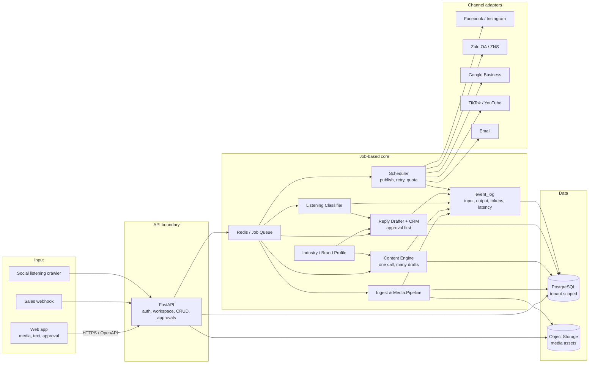
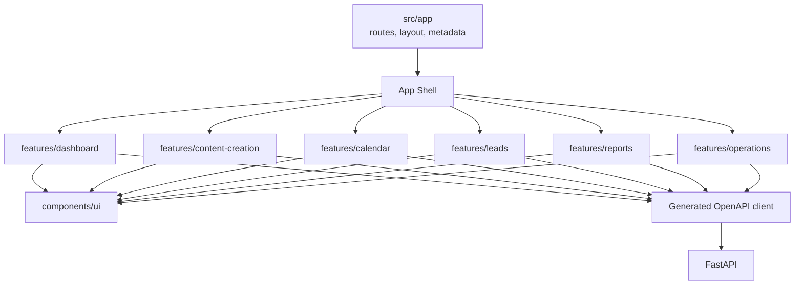
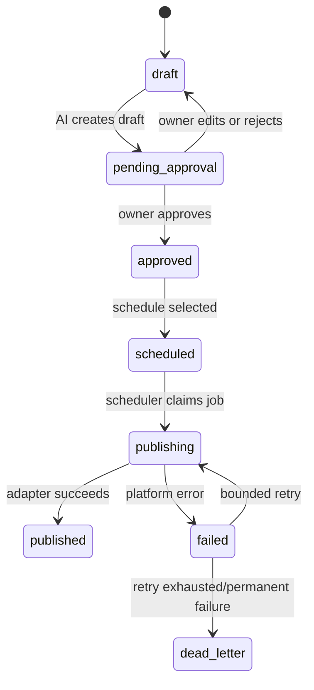
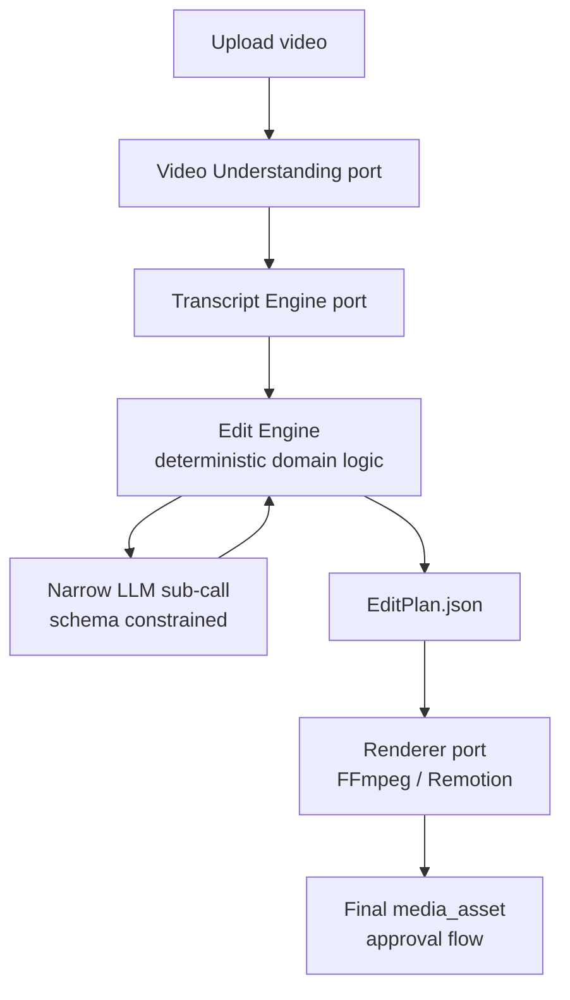

# Havi System Architecture

This is the canonical MVP deployment architecture, derived from the architecture
prototype, repository strategy, and technical spec.

## 0. Engineering Principles

Havi starts from invariants and simple interfaces. The system should be modular,
testable, observable, and scaled only where bottlenecks are proven.

### Required Principles

1. **Simple first:** begin with a modular monolith, one PostgreSQL database, and
   one queue. Do not add microservices, event buses, or extra databases before
   evidence requires them.
2. **Clear boundaries:** each module owns inputs, outputs, data, and failure
   modes.
3. **One-way dependencies:** entrypoints depend on application services;
   application services depend on domain/ports; adapters implement ports.
4. **Single source of truth:** PostgreSQL owns business state. Redis owns
   queue/cache/short locks. Calendar and dashboard are projections.
5. **Invariants before workflow:** approval, tenant isolation, quota, and
   idempotency are enforced in backend services/domain logic.
6. **Deterministic and idempotent:** retrying with the same command/idempotency
   key must not create duplicate external side effects.
7. **Failure isolation:** one job/adapter failure must not collapse unrelated
   requests.
8. **Observability is a feature:** request/job correlation, structured logs,
   state transitions, latency, token usage, and error reasons must be traceable.
9. **Scale by bottleneck:** API is stateless, workers scale by queue depth, media
   lives in object storage.
10. **Test contracts and invariants:** prioritize tests around module boundaries,
    state machines, tenant isolation, adapter contracts, and E2E smoke flows.

### Dependency Rules

Frontend:

```text
app/routes
    ↓
features
    ↓
components/ui + lib/api-client
```

- `app/` handles routing, layout, metadata, and composition.
- Features should not import private code from other features.
- UI primitives do not call HTTP directly.
- Feature data layers use the generated API client.

Backend:

```text
api / worker / scheduler          entrypoints
              ↓
application services             orchestration + transaction boundary
              ↓
domain + ports                   rules, state machine, interfaces
              ↑
repositories / provider adapters PostgreSQL, Redis, LLM, Facebook, storage
```

- Domain code does not import FastAPI, Celery, SQLAlchemy, Redis SDKs, LLM SDKs,
  or platform SDKs.
- API, worker, and scheduler call the same application services.
- Repositories/adapters translate I/O and do not own business decisions.
- Every schema change goes through Alembic.

Target backend structure:

```text
apps/backend/
├── api/                         # FastAPI entrypoint + thin routers
├── worker/                      # Celery entrypoint
├── scheduler/                   # Beat entrypoint
├── application/
│   └── services/                # Use cases + transaction boundaries
├── domain/
│   ├── models/                  # Entities/value objects
│   ├── policies/                # Approval, quota, scheduling, routing
│   └── ports/                   # Repository/provider interfaces
├── adapters/
│   ├── persistence/             # PostgreSQL repositories
│   ├── storage/                 # S3-compatible storage
│   ├── llm/                     # Text model providers
│   ├── publishers/              # Facebook/fake publishers
│   └── oauth/                   # OAuth clients
├── migrations/
└── tests/
```

`core/` is transitional scaffolding. Code should move into `domain/` and
`application/` gradually as boundaries mature; no big-bang rewrite is required.

## 1. System Overview



## 2. Frontend Architecture

The frontend uses Next.js App Router. Routes compose screens; features own
business-facing state and API calls.



Target structure:

```text
apps/web/src/
├── app/                         # Routing, layouts, metadata
├── components/
│   ├── app-shell/
│   └── ui/
├── features/
│   ├── dashboard/
│   ├── content-creation/
│   ├── calendar/
│   ├── leads/
│   ├── reports/
│   └── operations/
├── lib/
│   ├── api-client/
│   └── auth/
└── app/globals.css
```

## 3. Content State Machine



The backend is authoritative for the state machine. The frontend renders state
and sends actions; it never owns platform tokens, production prompts, or secrets.

## 4. Frontend Implementation Order

1. Lock design tokens and App Shell.
2. Build each screen with static fixtures.
3. Add prototype interactions inside each feature.
4. Generate the TypeScript client from OpenAPI and replace fixtures with API
   calls.
5. Add loading, empty, error, permission, and retry states before end-to-end
   integration.

## 5. Multi-Provider AI Layer

Status: text content generation is implemented; video/media pipeline remains
future scope.

### 5.1 Provider Router

`adapters/llm/` implements a domain `LLMProviderPort` for Gemini, Anthropic, and
OpenAI. Domain code depends on the port and `ProviderRouter`, not SDKs.

Provider fallback reasons:

1. outage, rate limit, timeout, or transient provider error
2. cost routing by workspace/plan
3. output fails schema or banned-claims validation

Every provider attempt should be observable through `event_log`: provider tried,
failure kind, final provider, latency, and token usage.

### 5.2 Token-Saving Funnel

Do not call expensive models at every step:

```text
100% input -> rules/keywords (0 tokens)
   -> small subset requiring semantics -> cheap classifier
      -> small subset requiring strong generation -> multi-provider LLM
```

The Content Engine is the main P0 use of multi-provider routing because it is
token-expensive and directly visible to users.

### 5.3 Future Video/Image Pipeline

Future content studio scope:



Design notes:

- Video understanding and transcription are separate ports.
- The Edit Engine should be deterministic and auditable.
- LLM calls should be narrow and schema-constrained, not responsible for the
  entire edit plan.
- `EditPlan.json` is a domain contract between the edit engine and renderer.
- Rendered output becomes a new `media_asset` and follows the same approval flow.
- This is not P0 pilot scope and should have its own quota/compute guardrails.
