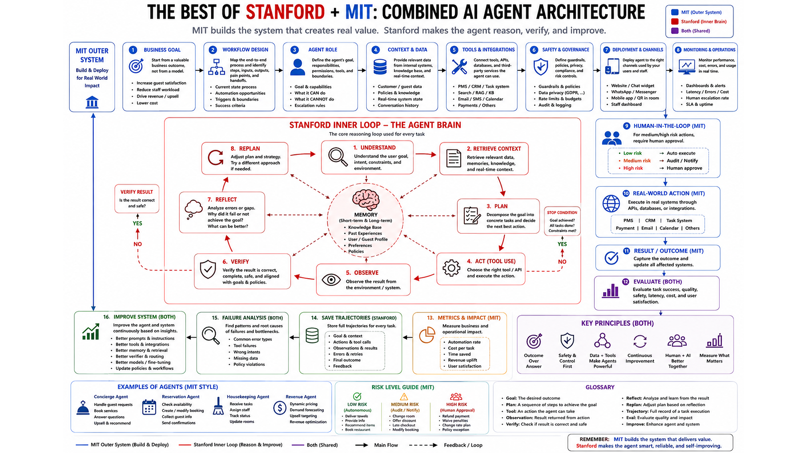

# Agent Principles & Architecture

This document defines the core principles, cognitive loop, and architectural design for AI Agents within Havi, mapping the Stanford/MIT AI Agent framework directly to Havi's backend runtime.

---

## 1. System Overview & Reference Diagram

The diagram below outlines the combined AI Agent Architecture (inspired by Stanford/MIT cognitive agent frameworks), illustrating how perception, memory, planning, tool usage, and execution interact:

---

## 2. Core Agent Principles

1. **Modular Perception & Execution**: Perception modules interpret user intent and context, while execution modules handle deterministic tool actions.
2. **Explicit Memory Layer**: Agents maintain short-term (contextual/session) memory and long-term (knowledge/retrieval) memory to preserve state cleanly.
3. **Structured Planning & Decomposition**: Complex goals are broken down into discrete steps with clear invariants and verification checks.
4. **Tool Safety & Isolation**: External side-effects are isolated, idempotent, and validated before execution.
5. **Human-in-the-Loop Guardrails**: No autonomous side-effect is executed in production without explicit owner approval.
6. **Observability & Traceability**: Reasoning steps, tool invocations, token metrics, and execution logs are captured for debugging and auditing.

---

## 3. Mapping Agent Principles to Havi Architecture

Havi operates as a **Semi-Autonomous Marketing Agent** ("Human-in-the-Loop AI Employee"). The table and detailed sections below describe how each layer of the Agent Architecture is implemented across Havi's stack:

| Agent Layer | Component in Stanford/MIT Model | Havi Implementation & Architecture Mapping |
| :--- | :--- | :--- |
| **Perception** | Sensor / Multi-modal Input | Ingest Pipeline (`apps/backend/worker/`), Audio Transcript Port, Media Storage (`adapters/storage/`), Social Listening Crawler |
| **Short-Term Memory** | Working Memory / Context Window | Celery Job Payload, Session Context, Fast Redis Cache |
| **Long-Term Memory** | Knowledge Base / Vector DB / Profile | `Brand Profile` (Tone, Products, Target Audience), Tenant Isolation in PostgreSQL (`domain/models/`), Historical Post Outcomes |
| **Planning & Decomposition** | Goal Decomposition & Strategy | Content Engine (`application/services/`), Token-Saving Funnel, Multi-Draft Prompt Decomposition |
| **Tool Execution** | Actuators / API Callers | Multi-Provider LLM Router (`adapters/llm/`), Platform Adapters (`adapters/publishers/` Meta, Zalo, Google, TikTok) |
| **Human Guardrails** | Human-in-the-loop / Governance | Content State Machine (`draft` → `pending_approval` → `approved`), Quota & Tenant Invariant Enforcement |
| **Observability & Reflection** | Feedback Loop / Monitoring | `event_log` Table (Tokens, Latency, Fallbacks, Errors), Analytics & Conversion Tracking |

---

### 3.1 Perception Layer (Nhận thức)
- **Input Channels**: Receives raw materials from shop owners—product photos, voice notes, thô raw text ideas, or sales webhooks.
- **Media Ingestion**: Audio files are routed through the `Transcript Engine Port` (Whisper/Gemini audio), while images are processed via vision LLMs to extract product features and visual style.

### 3.2 Memory Layer (Bộ nhớ)
- **Short-Term Context**: Transient working memory passed with each Celery task to generate multi-channel variations without state pollution.
- **Long-Term Brand Memory**: PostgreSQL stores tenant-level `Brand Profile` (brand voice, target demographic, product catalog, forbidden claims). This memory is automatically injected into prompt context during generation.

### 3.3 Planning & Decomposition (Lập kế hoạch)
- **Decomposition Strategy**: Single raw input job → 1 plan → Multi-channel specific drafts (Facebook post, TikTok script, Zalo OA message, Google Business update).
- **Token-Saving Funnel**: 
  1. `Rule Engine` (0 tokens): Filters keywords and checks quotas.
  2. `Cheap Classifier`: Classifies input intent and channel requirements.
  3. `Multi-Provider Generation`: Dispatches structured prompts to Gemini / Claude / OpenAI.

### 3.4 Tool Execution & Safety (Hành động & Công cụ)
- **Isolated Adapters**: Adapters in `apps/backend/adapters/publishers/` wrap external platform APIs (Facebook Graph API, Zalo ZNS).
- **Idempotency & Retry**: External tool execution is strictly idempotent using unique `idempotency_key`s and bounded retry logic to prevent double-posting.

### 3.5 Human-in-the-Loop Governance (Kiểm soát Người dùng)
- **Approval Invariant**: **Strict System Invariant**: No post can transition to `publishing` or call a platform publisher tool without explicit `approved` status set by the shop owner in PostgreSQL.
- **Content State Machine**: `draft` → `pending_approval` → `approved` → `scheduled` → `publishing` → `published`.

### 3.6 Observability & Reflection (Giám sát & Đánh giá)
- **Event Log Audit**: Every LLM call, prompt hash, model selection, token count, latency, and adapter error is recorded in `event_log`.
- **Closed-Loop Feedback**: Performance metrics (inquiries, engagement, conversion) feed back into the shop's long-term memory to continuously refine future post generation.

---

## 4. Integration & References

- **System Architecture**: See [SYSTEM_ARCHITECTURE.md](../SYSTEM_ARCHITECTURE.md) for backend monorepo structure and database schema.
- **Product Roadmap & Thesis**: See [ROADMAP.md](../../product/ROADMAP.md) for business thesis and product principles.
