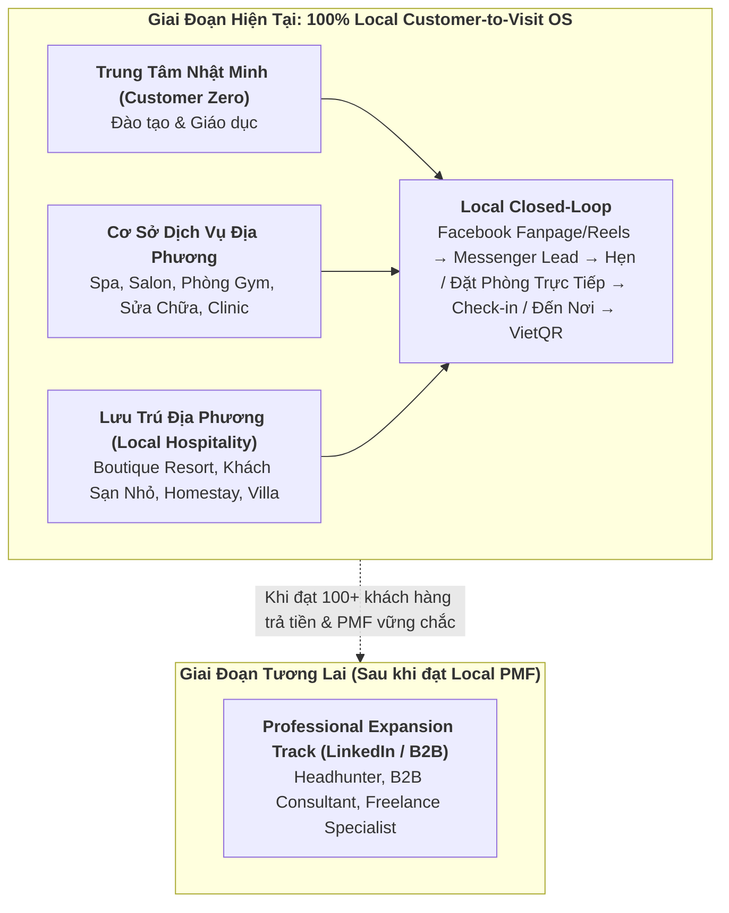
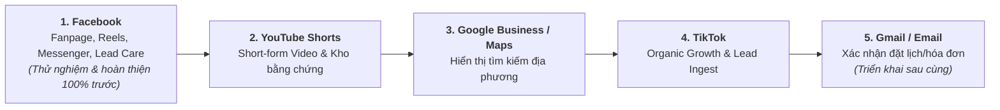

# Havi Product Roadmap

> Documentation language: English. Product UI/customer-facing copy remains
> Vietnamese because the target users are Vietnamese small-business owners.

## 1. Product Thesis: Havi 3.0 — Universal Goal-to-Roadmap Execution OS

Havi is an **AI operating system that turns an unclear objective into a usable
roadmap, guides execution one step at a time, learns from real evidence, and
replans with the user**.

The canonical product loop is:

`Goal → Roadmap → Next Action → Execution → Evidence → Review → Continue / Improve / Pivot → Replan`

The user's industry is context, not the product architecture. A training center,
hair salon, takeaway drink shop, motorcycle seller, restaurant, outsourcing
company, freelancer, programmer, HR team, singer, or actor can use the same core
system. What changes is the objective, constraints, available assets, metrics,
and execution modules—not the loop.

Havi's job is to remove the paralysis caused by not knowing what to do next:

1. clarify the result the user wants and the evidence that would count;
2. create a long-term direction and a concrete 30-day, 7-day, and daily plan;
3. recommend one feasible next action instead of presenting a wall of tools;
4. help execute authorized work through capability modules;
5. collect actual results and obstacles;
6. recommend whether to continue, improve, pivot, pause, or stop;
7. preserve plan history so every change is explainable and reversible.

Havi does **not** guarantee customers, revenue, virality, hiring success, or any
other external outcome. It guarantees a clearer process: a roadmap, visible
progress, evidence-based review, and an updated next step. It must distinguish
between facts, user assumptions, AI suggestions, completed actions, and verified
external results.

Content creation, publishing, lead care, CRM, analytics, recruiting, project
delivery, and eventually paid advertising are **execution capabilities** called
by roadmap tasks. None of them is the product root. In particular, Havi does not
promise to manufacture a studio-quality video: the authentic photos/video come
from the user, center, shop, or team; Havi may suggest a brief, hook, script,
shot list, checklist, caption, schedule, and distribution plan.

**North Star Metric:**

- **Weekly Guided Progress:** percentage of active workspaces that complete at
  least one committed roadmap action and one evidence-based review in a week.
- Goal-specific outcomes remain separate metrics: students enrolled, qualified
  leads, orders, hires, project milestones, audience growth, or another outcome
  explicitly chosen by the user.

**Customer Zero:** Trung Tâm Công Nghệ Nhật Minh validates the complete loop,
but the domain model and UX must remain goal-first and industry-agnostic.

**Scope decision (2026-08-23):** automated paid-ad creation, launch, and budget
management are deliberately deferred to a later phase. They are not required to
validate the core Havi loop. See §26.12 for the entry gates and safeguards.

## 2. Product Principles

1. **Goal before tool:** start with the desired change, deadline, evidence,
   constraints, and available resources—not an industry picker or feature menu.
2. **Plan long, commit short:** show direction at 90-day/30-day horizons, but ask
   the user to commit only to a realistic 7-day plan and one next action.
3. **One recommended next action:** Havi may expose alternatives, but it must
   explain and prioritize one recommendation to reduce choice paralysis.
4. **Evidence before replan:** ask what was done, what happened, and what blocked
   progress before changing the plan. Never invent success metrics.
5. **Adaptive, versioned roadmaps:** a roadmap is a living hypothesis. Revisions
   are append-only, attributable, explainable, and reversible.
6. **Human agency and approval:** the user chooses the goal and controls any
   consequential external action. Havi may automate only within explicit,
   revocable authorization and budget/scope limits.
7. **Industry-agnostic core:** industry, profession, and business type enrich
   context but never fork the core domain or onboarding journey.
8. **Capabilities are modules:** content, calendar, publishing, inbox, CRM,
   analytics, recruiting, project delivery, and ads execute roadmap tasks; they
   are not separate destinations competing for the user's attention.
9. **Authenticity over synthetic polish:** Havi organizes and improves the use
   of real business assets. It must not claim to have created a finished video or
   completed external work when it only produced a plan, script, or draft.
10. **Official APIs and backend-owned safety:** approval state, authorization,
    idempotency, tenant isolation, quota, token encryption, and reconciliation
    remain backend responsibilities.
11. **No false certainty:** recommendations display assumptions, confidence,
    dependencies, and measurement windows. Havi sells guidance and execution
    support—not guaranteed outcomes.
12. **Release only behind evidence:** local fake modes stay local; no feature
    ships until its required unit, integration, contract, and journey tests pass
    100%; no PII or secrets appear in observability UI.

## 3. Current Architecture Status

> Audited against the code on 2026-08-13. Items are graded by what a real user
> can complete end to end in production, not by what code exists. Findings and
> the reasoning behind each grade are in §13 (architecture) and §14 (business).

### 3.1 Implemented and reachable end to end

- Monorepo with `apps/web` and `apps/backend`
- Next.js frontend with App Router, feature folders, and edge middleware that
  enforces public/app realms and rewrites the legacy Vietnamese URL aliases
- FastAPI API, Celery worker, Celery Beat scheduler
- PostgreSQL models and Alembic migrations (9 revisions)
- Redis-backed queue/rate-limit infrastructure
- S3-compatible media upload tickets with MIME/signature validation
- Email/password auth, password reset contract, refresh sessions with HTTP-only cookies
- Workspace and member model
- Brand profile, voice/tone settings, and banned-claims policy
- Content jobs, content items, versions, approval, calendar, rescheduling
- Content Engine with provider router and fake provider tests
- Quota policy based on monthly token usage, evaluated in Vietnam time
- Platform connection storage with encrypted tokens
- Facebook OAuth + publisher through the official Graph API; fake publisher for local
- Zalo OA OAuth + paragraph-message publisher
- Publish scheduler, retry, dead-letter handling, idempotency, and event logging
- Publish adapter map built once in `worker/publish_service_factory.build_publishers()`
  and reused by `api/deps.get_publish_service`, so API retry and scheduler cannot diverge
- Fake-mode guardrails enforced at config load: mock LLM, fake publisher, disabled
  rate limit, and debug email all refuse to boot when `HAVI_ENV != local`
- Data deletion and account deletion (`DELETE /auth/me`, `DELETE /workspaces/{id}`,
  `/data-deletion` page, Meta signed-request callback)
- Global bilingual English/Vietnamese i18n across app screens
- Founder dogfooding protocol runner (`scripts/dogfood_suite.py`) and 7-day plan
- Frontend dashboard, content creation, calendar, failed publish panel, settings,
  reports, activity feed, internal operations UI
- Local E2E smoke test for signup -> draft -> approve -> fake publish -> report

### 3.2 Partial — code exists, the loop it belongs to cannot be completed

| Area | What exists | What is missing |
|---|---|---|
| Station 4 Lead & Care Loop | `inbox_items`/`leads` tables, `/leads` CRM API, Meta webhook ingestion with signature verification and dedupe, exact-match FAQ auto-reply, `DISMISSED` state, local inbound simulator | `send_reply` still writes DB state only and calls no publisher; no `/app/inbox` screen |
| Google Business channel | `GoogleBusinessPublisher` | No Google OAuth client registered in `api/deps._oauth_clients()`, so the channel is no longer advertised by `/connections/capabilities` and cannot be connected |
| Business outcome reporting | `/analytics/summary` computes inquiries, new leads, walk-ins, returning customers, and win rate from real rows, with period-over-period change | `walk_ins` proxies won leads because no POS/check-in source exists; `/analytics/attribution` still shares published posts rather than customers; no cost-per-job rollup |
| Video pipeline (Phase 3) | Stage 1 complete: `VideoProcessorPort`, ffprobe-on-upload, persisted duration/dimensions/aspect/audio, per-channel constraint policy, `eligible_channels` on the media API | Stages 2–6: multimodal understanding, transcript, Edit Engine, `EditPlan.json`, renderers, and channel dispatch are design-only |
| Short-form channels (Reels/TikTok/Shorts) | `Channel.REELS/TIKTOK/YOUTUBE` declared; upload-time eligibility checking | No publisher, no OAuth client, no API credentials — deliberately not built, see §17 |
| Billing and plans | `Plan` enum, `Workspace.plan`, `Subscription`/`Invoice` schemas, quota per plan | `/billing/*` raises `NotImplementedEndpoint`; nothing ever writes `Workspace.plan`; no trial expiry, no payment gateway |
| Domain layering | `domain/models`, `domain/policies`, `domain/ports` are clean | `core/` still holds `content_state.py`, `oauth_state.py`, `phone.py`, `schemas.py` — transitional scaffolding per SYSTEM_ARCHITECTURE §0 |

### 3.3 Not started

- Sales webhook and social listening — the `SALES` and `LISTEN` inputs in the
  SYSTEM_ARCHITECTURE §1 diagram still have no code (the Meta inbound leg now
  exists in `api/routers/webhooks.py`)
- Engagement snapshots from Meta (blocked on live permission approval)
- Any paid conversion path

## 4. Completed Milestones

### Week 1-2: Foundations

- Repository strategy and architecture documentation
- Backend domain boundaries and migration setup
- Auth/workspace/brand-profile persistence
- Frontend app shell, auth screens, landing page, onboarding, and core UI
  primitives
- OpenAPI client generation

### Week 3-4: Auth, Workspace, Media

- Email/password signup and login
- Password reset via email code
- Refresh-token rotation
- Workspace creation/activation
- Brand profile creation/update
- Media upload ticket and object-storage metadata flow
- Test coverage for auth, workspace, brand profile, media, route guards, and API
  client behavior

### Week 5-6: Content Engine and Approval

- Content job API and worker-side content engine
- Mock/fake LLM provider for deterministic local/test flows
- Multi-provider router for Gemini/Anthropic/OpenAI
- Structured output validation and banned-claims validation
- Content item state machine
- Draft editing and version history
- Approve/reject/reschedule flows
- Audit events for approval-sensitive actions
- Calendar view grouped by Vietnam time
- Calendar rescheduling UI sends offset-aware ISO datetimes and handles 409
  conflicts

### Week 7: Facebook Connection and Publishing

- Facebook OAuth flow and token encryption
- Facebook publisher adapter through official Graph API endpoints
- Fake publisher for local/test
- Publish job repository with unique idempotency key
- Scheduler dispatches due approved posts
- Worker claims jobs with row locks and bounded retry
- Dead-letter handling and manual retry API
- Failed-posts frontend panel with retry/reconnect guidance
- Publish event logging for success and failure

### Week 8: Real Dashboard and Observability

- `/analytics/dashboard` summary from real workspace data
- `/analytics/summary`, `/analytics/timeseries`, and `/analytics/attribution`
  from published content
- `/analytics/events` query over workspace-scoped `event_log`
- `/analytics/operations` aggregate operations metrics
- Frontend Dashboard and Reports no longer render fake business metrics
- Dashboard activity feed reads real event/audit rows and maps them to
  user-facing copy without leaking raw summaries or errors
- Internal route `/app/internal/operations` (legacy alias `/noi-bo/van-hanh`)
  shows aggregate operations metrics for pilot debugging
- Local E2E core-flow smoke test via `npm run e2e`

### Week 9: Staging Readiness

- Staging deployment runbook with pre-deploy checks, fake-mode guardrails,
  deploy order, required process checks, smoke test, migration forward/rollback
  rules, incident checklist, and backup/restore rehearsal steps
- Postgres backup and restore rehearsal commands for local/staging practice
- Object-storage backup and restore rehearsal guidance for local MinIO and
  provider-backed staging
- Security review checklist for founder beta with auth/session, token
  encryption, tenant isolation, upload validation, logging/redaction, fake-mode,
  dependency, deployment-secret, deletion, and consent gates
- Visual regression and accessibility baseline for major web routes across
  desktop and mobile viewports

## 5. Current Definition of Done

Every completed feature should satisfy:

- tenant isolation is enforced and tested where data crosses workspace boundary
- user-facing copy remains Vietnamese in the app
- internal docs and engineering notes are English
- no platform token, OTP, password, API key, or raw request body is exposed in UI
  or logs
- backend state machine owns approval/publishing rules
- idempotency exists for external side effects
- loading, empty, error, and retry states exist for user-facing flows
- verification commands are recorded in this roadmap or related docs

## 6. Verification Commands

Common web verification:

```bash
npm run lint:web
npm run test:web
npm run build:web
npm run test:visual
```

Common backend verification:

```bash
npm run infra:up
npm run migrate
cd apps/backend && uv run ruff check . && uv run pytest
```

Focused checks added during recent roadmap work:

```bash
npm run test:web -- --run src/features/calendar/calendar-screen.test.tsx
npm run test:web -- --run src/features/dashboard/dashboard-screen.test.tsx
npm run test:web -- --run src/features/operations/operations-screen.test.tsx
cd apps/backend && uv run pytest tests/test_analytics_flow.py
npm run e2e
cd apps/backend && uv run ruff check tests/test_e2e_core_flow.py
```

## 7. Current Priority Queue

> Re-derived from the 2026-08-22 public-launch audit. The list below the divider
> is retained as delivery history. The active source of truth is now §25,
> **10/10 Public Launch Program**. A checked historical item does not override a
> regressed test, a newer security finding, or a failed end-to-end release gate.

> Zalo scope is deferred by decision on 2026-08-13. Zalo OAuth, publishing,
> webhooks, and domain verification stay in the codebase but are out of the
> active queue and out of the gates below until the channel is picked back up.

Active now — execute in this order; full acceptance criteria are in §25:

1. [ ] **P0 Revenue integrity** — remove every production path that activates a
   plan before a verified payment; validate webhook signature, invoice, amount,
   currency, status, and unique gateway reference; add replay and reconciliation
   tests.
2. [ ] **P0 Production boot and secret safety** — make the production compose
   configuration boot with real providers, fail on missing secrets, remove
   default credentials, keep PostgreSQL/Redis/object storage private, and use
   private media with signed access.
3. [ ] **P0 Truthful delivery state** — never mark publish or reply success until
   the platform confirms it; persist the Facebook sender PSID; separate message
   replies from comment replies; reconcile ambiguous external outcomes.
4. [ ] **P0 Release test gate** — restore backend to 100% pass and repair the
   visual/accessibility harness to 36/36 on the current routes and UI. No release
   is allowed with a red check.
5. [ ] **P1 First-value journey** — replace simulated onboarding with a Business
   Truth Pack, connect one Facebook Page, and reach one verified live post in a
   median of five minutes or less.
6. [ ] **P1 Mobile product excellence** — reduce Content Studio to one primary
   mobile flow, move advanced controls behind progressive disclosure, meet WCAG
   2.2 AA, and meet Core Web Vitals `Good` thresholds at p75.
7. [ ] **P1 Server-side entitlements** — enforce plan/channel/post/video/lead/
   location limits in the backend and align all prices, quotas, trial copy, and
   invoices.
8. [ ] **P1 Facebook closed loop** — Multi-Page Picker, verified Page publishing,
   Messenger reply delivery, inbox-to-lead conversion, and real outcome reports.
9. [ ] **P2 Platform approvals** — run Meta review, Google Business approval,
   TikTok Direct Post audit, and YouTube audit in parallel; keep unapproved
   channels labeled Beta/export-only.
10. [ ] **P2 Paid pilot and SLO proof** — Customer Zero plus 5–10 design partners,
    real low-value PayOS transactions, alerting, restore rehearsal, and 30 days
    of measured SLO/activation/retention evidence before public launch.

---

Shipped in the External Beta phase:
- [x] Dependency vulnerability scanning audit (`npm audit` & `pip-audit` verified cleanly with 0 backend vulnerabilities).
- [x] Add HTTP-only cookie support (`havi_refresh_token`) for refresh tokens on auth endpoints and frontend fetch clients.
- [x] Facebook App Review submission package & compliance infrastructure (Meta Data Deletion Callback API, `/data-deletion` page, and submission guide in `docs/operations/FACEBOOK_APP_REVIEW.md`).
- [x] Station 4: Lead & Care Loop (Unified Inbox, AI Reply Generator, Exact FAQ Auto-matching, and `/inbox` & `/leads` REST APIs).
- [x] Phase 2 Zalo OA Integration & Publishing Flow (`ZaloOAuthClient`, OpenAPI v3 paragraph message adapter, multi-channel publisher factory, and `test_zalo_publisher.py` test suite).
- [x] Prepare marketing landing page assets & external pilot launch operational guide (`docs/operations/EXTERNAL_BETA_LAUNCH.md`).

## 8. Upcoming Work

### Completed: Founder Dogfooding Plan

Status: completed
- [x] 7-day internal beta checklist (Day 1 through Day 7 action guide)
- [x] Automated 7-day founder dogfooding protocol runner (`scripts/dogfood_suite.py`)
- [x] daily tasks and operational telemetry log template
- [x] P0/P1 bug triage SLAs and response times defined
- [x] immediate stop rules (kill switches) defined for system failures or credential leaks
- [x] criteria for inviting external beta cohort defined

### Completed: Data Deletion, Account Deletion, and Consent Records

Status: completed in `docs/security/DATA_RETENTION_AND_CONSENT.md`.

Acceptance criteria:

- [x] user/account deletion behavior defined & implemented via `DELETE /auth/me`
- [x] workspace deletion behavior defined & implemented via `DELETE /workspaces/{id}`
- [x] retained audit/event data defined with rationale & anonymization
- [x] platform token deletion and reconnect behavior defined
- [x] consent records for automation (`publish_mode`) and platform OAuth connections defined & recorded
- [x] covered by backend integration test suite (`tests/test_deletion_and_consent.py`) and frontend UI in Settings

### Completed: Staging Runbook and Backup/Restore Rehearsal

Why: founder beta must not start until deployment, data recovery, and rollback
steps are concrete.

Implemented in `docs/handoff/DEPLOYMENT.md`:

- runbook lists the four required processes: web, API, worker, beat
- startup flags and local-only fake modes are checked
- migration forward/rollback process is documented
- Postgres backup and restore rehearsal steps are documented
- object-storage backup/restore approach is documented
- incident response owners and commands are listed

Verification:

```bash
npm run migrate
cd apps/backend && uv run alembic check
```

### P0: Security Review Checklist

Status: completed for founder beta in `docs/security/SECURITY_REVIEW.md`.

Acceptance criteria:

- [x] auth/session/token handling reviewed
- [x] platform token encryption reviewed
- [x] tenant isolation reviewed
- [x] upload validation reviewed
- [x] logs/events checked for secrets and PII
- [x] local-only flags verified as blocked outside local
- [x] dependency and deployment secret handling reviewed

Follow-ups completed for external beta:

- [x] Data deletion, account deletion, and consent policy implemented (`DELETE /auth/me`, `DELETE /workspaces/{id}`, `/data-deletion` page, Meta signed request callback API).
- [x] Dependency vulnerability scanning audit (`npm audit` & `pip-audit` verified cleanly with 0 vulnerabilities).
- [x] Refresh-token storage moved from `localStorage` to HTTP-only cookies (`havi_refresh_token`).

### P1: Visual Regression and Accessibility Baseline

Status: **regressed and release-blocking as of 2026-08-22**. The historical
baseline repair reached 36/36, but the current audit run reached only 2/36 after
subsequent route, heading, and UI changes. This result means the harness and its
baselines are no longer current; it does not by itself prove that every route
has an accessibility defect.

Acceptance criteria:

- [x] baseline screenshots for major app routes
- [x] smoke accessibility checks for nav/forms/buttons/states
- [x] mobile and desktop viewport checks
- [x] documented command for local/CI execution
- [x] Repaired 2026-08-13: the whole suite (30 of 32 checks) had been failing.
      Two causes, both from earlier work that never re-ran it — the route table
      still pointed at the pre-Gate-J Vietnamese paths (`/bao-cao`, `/noi-dung`)
      after the app moved to `/app/*`, and the authenticated fixture seeded only
      `localStorage` while `src/middleware.ts` gates `/app/*` on the `havi_session`
      **cookie**, which edge middleware can read and `localStorage` is invisible to.
      Every authenticated route redirected to `/login` before React ran. Now 36/36
      pass, `/app/inbox` has a baseline, and axe runs clean on every route
- [ ] Repair 2026-08-22 regression: update the route readiness contract and
      intentional screenshots for the current product only after reviewing each
      diff; add Billing and Video Studio coverage; return the suite to 36/36 or
      higher without blindly updating snapshots.

## 9. Metrics That Matter

North Star metric:

- **Weekly Guided Progress:** percentage of active workspaces that complete at
  least one committed roadmap action and one evidence-based review per week.

Universal product metrics:

- goal clarified → roadmap accepted rate
- roadmap accepted → first task scheduled/completed rate
- median time from goal creation to first scheduled action
- first evidence-based review completion within 14 days
- week-4 Weekly Guided Progress and paid retention
- blocked-task recovery and accepted-replan rate
- user-rated roadmap clarity, feasibility, and recommendation relevance
- zero fabricated completion, unauthorized external action, or cross-tenant leak

Goal outcome metrics are defined per goal rather than hardcoded by industry. A
verified enrollment, sale, hire, delivery, audience result, publish, reply, lead,
appointment, or POS transaction can be outcome evidence; an AI draft alone is
never external-outcome evidence.

Content/publishing capability metrics:

- signup → Business Truth Pack completion rate
- signup → first connected Page rate
- signup → first verified live publish activation rate
- median and p90 time from signup to first verified value
- time from first draft to first approved post
- approved drafts per workspace
- platform-confirmed published posts per workspace
- publish failures by kind
- reconnect rate
- owner edits per draft
- support time per workspace
- day-1/day-7 activation and week-4 retention by acquisition cohort
- weekly active workspaces with at least one verified outcome

Operational metrics:

- event count
- error count/rate
- avg/p95 job latency
- token totals
- provider breakdown
- publish success/dead-letter rate
- quota near/exceeded events

Business metrics:

- cost per content job
- cost per approved draft
- cost per published post
- founder support time
- conversion from trial to paid plan
- payment checkout → verified payment → activated subscription conversion
- unpaid activation count (target: zero)
- month-one paid renewal and gross revenue retention

## 10. Risks and Mitigations

| Risk | Impact | Mitigation |
|---|---|---|
| Facebook App Review takes longer than expected | Blocks public publishing rollout | Closed beta can use Development mode with manually added testers |
| Fake publisher or mock LLM reaches staging | Users see false success | Backend validators block fake modes outside local |
| Beat is not running | Scheduled posts never publish | Deployment checklist and runbook must verify beat |
| Redis outage disables rate limits | Abuse can pass unthrottled | Redis failure alerting required because limiter fails open |
| Tenant isolation bug | Cross-customer data leak | Workspace-scoped queries and tests |
| Duplicate publish | Same post published twice | Publish idempotency key, unique constraint, and row locks |
| Raw provider errors leak to UI | Secrets/PII exposure | User-facing copy maps errors to safe categories |
| Token cost grows silently | Margin loss | Token quota, event log usage, operations UI |
| Backup restore rehearsal grows stale | Data recovery becomes unproven again | Rehearse after infrastructure changes and before customer beta |

## 11. Decisions to Revisit

| Decision | Current choice | Revisit trigger |
|---|---|---|
| Primary auth | Email/password | Add OTP/Zalo login only when business need is clear |
| First publishing channel | Facebook Page | Add Google/Zalo/TikTok based on beta demand and API access |
| Quota unit | Tokens | Add money conversion after pricing model stabilizes |
| Repository model | Monorepo | Split only when ownership/security/deployment cadence requires it |
| Video pipeline | Phase 3 Architecture documented (`docs/architecture/VIDEO_PIPELINE.md`) | Multimodal video understanding, WhisperX transcript, EditPlan.json, and FFmpeg/Remotion renderers for Reels, TikTok, & Shorts |
| Full-auto publishing | Opt-in only | Unlock only after trust/edit-rate evidence exists |

## 12. Agent Loop Notes

`agent-loop/roadmap.example.json` is the machine-readable execution roadmap
derived from this product roadmap. `agent-loop/roadmap.json` is local runtime
state and should not be treated as the source of truth.

Workflow:

1. Update this roadmap when a task is genuinely completed and verified.
2. Keep `agent-loop/roadmap.example.json` aligned with the next executable tasks.
3. Run small batches; do not let the loop edit indefinitely.
4. Commit/push remains manual.

Recommended JSON checks:

```bash
python3 -m json.tool agent-loop/roadmap.example.json
test ! -f agent-loop/roadmap.json || python3 -m json.tool agent-loop/roadmap.json
```

## 13. Architecture and System Design Review (2026-08-13)

Scope: `apps/backend` (~18.5k LOC Python, 26 test modules, 9 Alembic revisions),
`apps/web` (104 TypeScript modules), `docs/`, and CI.

### 13.1 What holds up

These are load-bearing and should not be reworked:

- **Layering is real, not aspirational.** `domain/policies` and `domain/ports`
  import no FastAPI, SQLAlchemy, Celery, or provider SDK. Adapters implement the
  ports. The dependency rule in SYSTEM_ARCHITECTURE §0 is actually followed.
- **One publisher map, three entrypoints.** `build_publishers()` is defined once
  in the worker factory and imported by `api/deps.get_publish_service`. Adding a
  channel cannot leave API retry and the scheduler disagreeing about support.
- **Fake modes cannot escape local.** Config-load validators reject mock LLM,
  fake publisher, disabled rate limiting, and debug email whenever
  `HAVI_ENV != local`. This closes the highest-impact "users see false success"
  risk in §10 at the only place that cannot be bypassed.
- **Quota reasons in the right unit.** Tokens rather than money, month boundary
  computed in `Asia/Ho_Chi_Minh` then converted to UTC, unknown plan degrades to
  Trial rather than to unlimited. The rationale is documented in the module.
- **Publish safety.** Idempotency key with a unique constraint, row-locked claim,
  bounded retry, dead-letter, and event logging.
- **Legacy URL aliases.** `apps/web/src/middleware.ts` rewrites the old
  Vietnamese paths, so the `/huong-dan-xoa-du-lieu` URL already filed with Meta
  keeps resolving after the English route rename.

### 13.2 Structural gaps

**A. There was no inbound event plane. — FIXED.** No webhook endpoint existed for
any platform, and `InboxService.process_inquiry` — the only code path that
creates an `inbox_item` — was not exposed by any router, so Station 4 could not
receive a single real message. Worse, that dead path would have crashed on first
call: it invoked `BrandProfileRepository.get_by_workspace`, a method that does
not exist. `api/routers/webhooks.py` now implements the Meta leg with signature
verification, the subscribe handshake, page→workspace lookup, and dedupe;
`tests/test_webhook_ingestion.py` covers it. The `SALES` and `LISTEN` inputs in
the architecture diagram are still unimplemented.

**B. Replies are recorded, not delivered.** `InboxService.send_reply` and the FAQ
auto-match branch both write `InboxItemStatus.SENT` to Postgres and call no
publisher adapter. A row marked `sent` currently means "we wrote it down". Any
report built on it would overstate what reached the customer.

**C. `dismiss_item` wrote `SENT`. — FIXED.** `InboxItemStatus` had only `new`,
`drafted`, `sent`, so dismissing an item was indistinguishable from answering it.
`DISMISSED` added; `dismiss_item` uses it.

**D. FAQ matching was substring, not exact. — FIXED.** The matcher tested
`question in content.lower()`, so a short approved question fired on any message
containing it. Principle 1 permits automation only for *exact* pre-approved FAQ
responses, and this is the one place in the system that can put text in front of
a customer without approval. Matching is now equality after normalization, and
every auto-send writes an `inbox.faq_auto_reply` event.

**E. Google Business was advertised but not connectable. — FIXED.**
`/connections/capabilities` listed `google_business` while
`api/deps._oauth_clients()` registered only Facebook and Zalo, so
`/connections/google_business/start` returned 501. Capabilities now derives from
`ConnectionService.supported_platforms()`, and a test asserts every advertised
platform's `/start` does not return 501.

**F. The video pipeline was documented ahead of the code. — INGESTION DONE.**
`adapters/media/ffmpeg_processor.py` was imported only by its own test. Stage 1
of `VIDEO_PIPELINE.md` now exists end to end: `VideoProcessorPort`,
per-channel constraints, probe-on-upload, and persisted metadata (§16). The Edit
Engine, `EditPlan.json`, renderers, and channel dispatch remain design-only.

The adapter also had a quiet correctness bug worth naming: when `ffprobe` was
missing or the bytes were corrupt, `probe_file` returned a **fabricated**
`1920x1080 / 16:9 / no audio`. Persisting that would have recorded broken uploads
as valid Full HD video, passed them through channel validation, and failed only
at publish time. It now returns `None`, and `check_video_for_channel(None, ...)`
refuses rather than approving.

**G. `core/` still holds domain-adjacent logic.** `content_state.py`,
`oauth_state.py`, `phone.py`, and `schemas.py` are the transitional scaffolding
SYSTEM_ARCHITECTURE §0 expects to migrate into `domain/` and `application/`.
No rewrite is needed, but the move should happen before the next module lands on
top of it.

**H. Frontend surfaces lag the backend.** There is still no `/app/inbox` route or
nav entry, so the Station 4 API has no UI. The hardcoded fixture badge counts in
`components/app-shell/nav-items.ts` (`count: 3`, `count: 2`) — the last fake
numbers left in the product after the §4 Week-8 cleanup — have been removed.

**J. The generated API client was stale.** `apps/web/src/lib/api-client/schema.d.ts`
still declared `/crm-messages` and `/leads/{lead_id}/messages`, endpoints the
backend does not serve. Regenerating dropped 241 lines of dead contract. CI runs
`lint`/`test`/`build` but never `generate:api`, so drift between the backend
contract and the committed client is invisible — worth a CI check that
regeneration produces no diff.

**I. Documentation drift after the English route rename.** `README.md`,
`docs/handoff/DEPLOYMENT.md`, `docs/testing/VISUAL_ACCESSIBILITY.md`,
`docs/operations/DOGFOODING_PLAN.md`, and
`docs/operations/FACEBOOK_APP_REVIEW.md` still document Vietnamese paths. The
aliases keep them working, so this is a correctness-of-docs problem rather than
an outage, but the Meta submission doc should name the canonical URL.

### 13.3 Defects

| Status | Severity | Location | Finding | Fix applied |
|---|---|---|---|---|
| Fixed | P0 security | `api/main.py` | `/zalo_verifier{rest:path}` joined the user-controlled `rest` into a filesystem path and returned it with `FileResponse`. An encoded-traversal request resolves outside `apps/web/public` and can read the repo `.env`, which holds `HAVI_JWT_SECRET`, `HAVI_TOKEN_ENCRYPTION_KEY`, and every provider API key. | Suffix compared exactly against `Settings` with `compare_digest`; response body is built in code, no filesystem access; route 404s unless configured. `tests/test_zalo_verifier.py` replays the traversal payloads. |
| Fixed | P0 config | `api/main.py` | Site-verification token hardcoded in the `/` HTML handler. | Moved to `HAVI_ZALO_SITE_VERIFICATION`; value HTML-escaped; tag omitted when unset. |
| Fixed | P0 correctness | `application/services/inbox_service.py` | `process_inquiry` called `BrandProfileRepository.get_by_workspace`, which does not exist — the FAQ path would have raised `AttributeError` on its first real call. Undetected because nothing invoked it. | Corrected to `.get()`; now covered by webhook tests. |
| Fixed | P1 correctness | `application/services/inbox_service.py` | `dismiss_item` recorded `SENT` (gap C). | `InboxItemStatus.DISMISSED` + migration `a3d41c9b2e77`. |
| Fixed | P1 correctness | `application/services/inbox_service.py` | Substring FAQ match could auto-send to a customer whose message merely contained an approved question (gap D). | Exact match after normalization; auto-sends write an audit event. |
| Fixed | P1 honesty | `api/routers/analytics.py` | `/analytics/summary` returned literal zeros for the five outcome fields. | Computed from `leads`, `inbox_items`, and `content_items`, with period-over-period change. `walk_ins` documents its proxy. |
| Fixed | P2 | `components/app-shell/nav-items.ts` | Fixture badge counts rendered in production. | Removed pending a real source. |
| Fixed | P2 | `api/routers/connections.py` | Capabilities advertised an unconnectable channel (gap E). | Derived from registered OAuth clients. |
| Fixed | P2 | `apps/backend` (12 files) | `ruff` reported 32 errors on `dev`, so the backend CI job was red before any of this work. | All fixed; `ruff check .` clean. |
| Fixed | P1 | `domain/models/__init__.py` | `ContentJob`/`ContentItem`/`ContentItemVersion` were in `__all__` but never imported, so `Base.metadata` was missing the content tables. `uv run alembic check` — a documented verification command in §6 — crashed with `NoReferencedTableError`, and autogenerate would have proposed dropping those tables. | Added the import. |
| Fixed | P1 | `domain/models/inbox.py`, `domain/models/lead.py` | With `alembic check` working, it immediately reported drift: the Station 4 migration created `TEXT` columns and `ON DELETE CASCADE` foreign keys, but the models declared `String` and plain FKs. | Models aligned to the migration; `alembic check` now clean. |
| Open | P1 | `application/services/inbox_service.py` | `send_reply` marks an item `SENT` without calling any adapter — nothing is delivered (gap B). | Needs a reply-delivery port; see Gate G. |

### 13.4 Design recommendations

1. **Add the inbound plane as a first-class module**, not as an endpoint bolted
   onto `inbox`. It needs signature verification per platform, replay-safe
   dedupe on the platform message id, and the same `event_log` treatment the
   publish path already has. Reuse the publish-side idempotency pattern.
2. **Make delivery a port.** `send_reply` should go through a
   `ReplyPublisherPort` with the same fake/real split as `PublisherPort`, so
   inbox delivery inherits the fake-mode guardrails instead of side-stepping
   them.
3. **Attribute leads to content.** `leads` has `source` but no `content_item_id`.
   Without that column, "which post brought this customer" — the product's
   headline claim — cannot be answered no matter how good the reporting UI gets.
4. **Derive the capabilities endpoint** from the registered OAuth clients and
   publisher map, so an unwired channel cannot be advertised again.
5. **Land the `core/` → `domain/` migration** in small steps, starting with
   `content_state.py`, which is pure state-machine logic.

## 14. Business Model Review (2026-08-13)

### 14.1 The product cannot currently take money

- Pricing exists only as landing copy and an enum docstring
  (`core.enums.Plan`: trial / Tiệm Nhỏ 299K / Toàn Diện 599K).
- `/billing/subscription` and `/billing/invoices` are the only two endpoints in
  the backend that raise `NotImplementedEndpoint`. There is no payment gateway,
  no subscription record, no invoice.
- `Workspace.plan` defaults to `Plan.TRIAL` and **nothing in the codebase ever
  writes it** — the only read is the quota check in `content_service`. Every
  workspace is permanently on Trial: 100k tokens/month, roughly 16–33 content
  jobs at the 3–6k tokens/job estimate documented in `domain/policies/quota.py`.
- The 14-day trial the landing page advertises is not enforced anywhere. There is
  no trial start or expiry field, no downgrade, no dunning.

Consequence: `docs/operations/EXTERNAL_BETA_LAUNCH.md` can onboard 10–20 shops,
but none of them can convert, and "conversion from trial to paid plan" in §9 is
unmeasurable by construction.

### 14.2 The product cannot yet prove the outcome it sells

Havi's pitch is outcomes over vanity metrics. Today `/analytics/summary` returns
hardcoded `0` for `price_inquiries`, `walk_ins`, `returning_customers`,
`new_leads`, and `lead_won_rate`, and `/analytics/attribution` reports the share
of *published posts* per channel with the honest note "tạm tính theo bài đã
đăng". The reports screen is truthful — it does not fake numbers — but it shows
a shop owner nothing they would pay 299K/month for.

This is downstream of §13 gap A. Without inbound events there is no inquiry to
count, and without lead-to-content attribution there is nothing to attribute. The
measurement loop, not the pricing page, is the blocker.

### 14.3 Unit economics are not instrumented

`event_log` records token totals and provider breakdown, which is the hard part.
What is missing is the money rollup: cost per content job, cost per approved
draft, cost per published post, per plan. §9 lists these as business metrics and
nothing computes them. Setting 299K/599K price points before measuring
cost-per-job during the pilot is a guess about gross margin.

### 14.4 Recommended sequencing

1. Close the measurement loop: webhooks → inbox → lead → outcome, with
   `content_item_id` on `leads`.
2. Ship real numbers on the reports screen for pilot shops.
3. Measure cost per job / per approved draft over the pilot cohort and convert
   the token quotas into a margin model.
4. Only then build billing: trial expiry, plan change, VNPay/Momo, invoices.

Building billing first would produce a checkout for a product whose value panel
reads zero.

## 15. Revised Release Gates

### Gate F: Deploy Safety (blocks any non-local deploy)

- [x] Domain-verification handler restricted to an exact configured suffix; no
      request input reaches a filesystem path (`tests/test_zalo_verifier.py`
      covers the traversal payloads that previously read `.env`)
- [x] Verification token moved from source into `Settings`
      (`HAVI_ZALO_SITE_VERIFICATION`, `HAVI_ZALO_VERIFIER_SUFFIX`); both empty by
      default, so the routes are inert until an environment opts in
- [x] `/` returns a static page and does not shadow any router path
- [x] Dockerfiles, production compose, nginx configuration, and deploy scripts
      now exist.
- [ ] Production configuration boots successfully with `HAVI_ENV=production`
      and explicit real email, LLM, and publisher providers. The 2026-08-22
      audit fails at configuration validation because production inherits the
      debug email default; mock LLM/fake publisher defaults would also be
      rejected if not explicitly disabled.
- [ ] Remove all default production database, object-storage, JWT, webhook, and
      token-encryption secrets; fail startup when a required secret is absent.
- [ ] PostgreSQL, Redis, and object storage are internal-only; media is private
      by default and delivered through signed access rather than an anonymous
      bucket with wildcard CORS.
- [ ] Readiness checks verify PostgreSQL, Redis, object storage, and the worker
      queue; liveness checks only process health; a failed deploy rolls back.

### Gate G: Trustworthy Inbound Loop (blocks external beta)

- [x] Meta webhook endpoint with `X-Hub-Signature-256` verification and challenge
      handshake (`api/routers/webhooks.py`)
- [x] Platform message id dedupe so redelivery cannot create duplicate inbox
      items — enforced by a Postgres unique constraint, not a read-then-write
- [x] `InboxItemStatus.DISMISSED` added with migration; `dismiss_item` uses it
- [x] FAQ auto-reply matches exactly, and every auto-send writes an audit event
- [x] Local-only inbound simulator (`POST /webhooks/dev/simulate`) so the UI and
      reports can be built against data before Meta review completes; blocked
      outside `HAVI_ENV=local` like every other fake mode
- [x] Tenant isolation tests for webhook-created rows
      (`tests/test_analytics_outcomes.py::test_other_workspace_data_never_leaks`)
- [x] Webhook receipts written to `event_log` (`inbox.webhook_received`) with page ID and message ID correlation fields
- [x] Reply delivery goes through a publisher port (`ReplyPublisherPort` and `FakeReplyPublisher`) for local and test, subject to existing `HAVI_ENV` guardrails
- [x] `/app/inbox` screen with loading, empty, error, retry, and reply states

### Gate H: Provable Outcomes (blocks paid conversion)

- [x] `/analytics/summary` computes inquiries, new leads, won leads, returning
      customers, and win rate from real rows, plus period-over-period change
- [x] Fixture badge counts removed from `nav-items.ts`
- [x] `leads.content_item_id` added with migration (`c9f87d6e5a43_leads_content_item_id.py`)
- [x] `/analytics/attribution` attributes customers to content items and channels
- [x] `walk_ins` renamed to `won_leads` across the API, the generated client, and
      the Reports screen, because no check-in source exists to measure walk-ins.
      A real check-in source becomes a *separate* field rather than a redefinition
      of this one; `test_won_leads_and_win_rate` asserts `walk_ins` is absent from
      the response so the misleading name cannot come back
- [x] Cost-per-job and cost-per-approved-draft rollups available in `/analytics/operations`

### Gate I: Monetization

- [x] Trial start/expiry persisted (`trial_ends_at`) and enforced in ContentService
- [x] `/billing/subscription`, `/billing/invoices`, checkout creation, and PayOS/
      VietQR webhook routes exist.
- [ ] Remove or local-gate `POST /billing/plan`: it currently changes the plan
      and grants 30 days while creating only a `PENDING` invoice.
- [ ] Remove frontend fallback/manual confirmation paths that call `changePlan`
      when checkout fails or when a user claims to have transferred money.
- [ ] Require and verify the PayOS signature in every non-local environment;
      reject a generic webhook when its required signature is missing.
- [ ] Activate a subscription only when invoice, amount, currency, successful
      payment state, and unique gateway reference all match in one transaction.
- [ ] Add replay protection, idempotent redelivery, reconciliation, refund/
      cancellation handling, and an immutable payment audit trail.
- [ ] Enforce plan entitlements in the backend and align posts, token quota,
      video, lead, channel, location, and branch limits with pricing copy.
- [ ] Execute real low-value PayOS end-to-end tests because PayOS has no sandbox;
      prove success, wrong amount, invalid signature, replay, timeout, and retry.
- [ ] Margin model and final price points are derived from measured pilot cost
      per verified outcome and month-one renewal behavior.


### Gate J: Channel Truthfulness

- [x] `/connections/capabilities` derived from registered OAuth clients
- [x] Google Business removed from capabilities and re-graded in §3.2
- [x] Meta data-deletion status URL points at the canonical `/data-deletion`
- [x] Docs updated to canonical English routes across `README.md`,
      `DEPLOYMENT.md`, `VISUAL_ACCESSIBILITY.md`, `DOGFOODING_PLAN.md`, and
      `FACEBOOK_APP_REVIEW.md`
- [x] CI fails when `npm run generate:api` produces a diff, enforced via `OpenAPI Client Drift Check` step in `.github/workflows/ci.yml`

## 16. Video Ingestion (Phase 3, Stage 1) — Shipped 2026-08-13

Stage 1 of `docs/architecture/VIDEO_PIPELINE.md` is implemented and tested. It
needs no platform credential, which is exactly why it went first.

What exists:

- `domain/ports/media.py` — `VideoMetadata` value object and `VideoProcessorPort`.
  The contract explicitly requires `None` on failure rather than defaults.
- `adapters/media/ffmpeg_processor.py` — implements the port via `ffprobe`.
  Returns `None` when the binary is absent or the bytes are unreadable.
- `domain/policies/video_constraints.py` — pure policy, no I/O. Per-channel
  aspect ratio, duration bounds, and audio requirements for Reels, TikTok, and
  YouTube Shorts, plus `eligible_channels()`.
- `media_assets` gains `duration_seconds`, `width`, `height`, `aspect_ratio`,
  `has_audio` (migration `b8e52d1f4a90`). All NULL-able: NULL means *not
  measured*, which is a different fact from zero.
- `MediaService.complete_upload` probes videos after the magic-byte check and
  persists the result. A probe failure logs and leaves the asset `RAW` — a Havi
  operational problem must not fail a user's successful upload.
- `GET /media` and `POST /media/{id}/complete` return the metadata plus
  `eligible_channels`.

Why probe at upload rather than at publish: a shop owner records a clip on a
phone and schedules it for Saturday evening. If the aspect ratio is only checked
when the scheduler calls the platform API, the failure surfaces after the slot
has passed and cannot be fixed. At upload, there is still time to reshoot.

Verification:

```bash
cd apps/backend && uv run pytest tests/test_video_ingestion.py
```

The probe tests build real clips with `ffmpeg testsrc` and read them back rather
than mocking `ffprobe`. The hard part is interpreting ffprobe output — which
stream carries duration, which is the video stream, what counts as 9:16 — and a
mock would just enshrine whatever assumption was made. They skip when `ffmpeg`
is not on PATH; CI does not install it yet.

Follow-ups:

- [x] `ffmpeg` installed in CI (`.github/workflows/ci.yml`), so the probe tests
      run there instead of skipping
- [x] `eligible_channels` surfaced in the content-creation UI: the upload row for
      a clip lists each video channel with "đăng được" / "không đăng được", so the
      owner reads "this clip fits Reels but not Shorts" while there is still time
      to reshoot. An unprobed clip says *chưa đọc được thông số* rather than
      claiming it fits nothing — "unknown" and "ineligible" are different facts.
      Video uploads deliberately do **not** become raw-input chips: `RawInputKind`
      has no `video` and no video channel can publish yet (§17), so offering it as
      generation input would promise something that does not exist
- [x] Thumbnail extracted and stored: `thumbnail_bytes` on the port,
      `media_assets.thumbnail_object_key` (migration
      `d4b1e6905c27_media_assets_thumbnail_object_key.py`), and `thumbnail_url` on
      the `MediaAsset` schema. The clip is read from storage **once** for both the
      probe and the frame, and a thumbnail failure is swallowed into logs — a
      successful upload must not fail because a preview image did not render

## 17. Why Reels, TikTok, and YouTube Publishing Is Not Built Yet

Recorded because `Channel.REELS`, `Channel.TIKTOK`, and `Channel.YOUTUBE` have
existed in `core/enums.py` since early on, and their absence is a decision rather
than an oversight.

1. **The blocker is access, not code.** TikTok's Content Posting API and the
   YouTube Data API both require app review; Reels needs the same Meta review
   that is still pending. An adapter that cannot be run against the real endpoint
   is unverifiable. This project already shipped exactly that mistake once:
   `GoogleBusinessPublisher` existed, was advertised by
   `/connections/capabilities`, and returned 501 on connect because no OAuth
   client was ever registered (§13.2 gap E). Adding three more channels on the
   same footing would triple it.
2. **The quota model cannot price video.** Quota is denominated in LLM tokens
   (`MONTHLY_TOKEN_QUOTA`). A rendered video costs multimodal tokens *plus*
   transcription GPU-seconds, FFmpeg CPU-minutes, storage, and egress — none of
   which are tokens. Shipping video publishing on a token quota is the §10
   "token cost grows silently" risk with the largest cost component uncounted.
3. **Rendering does not fit the current runtime.** One Celery pool serves content
   generation and scheduled publishing. A minutes-long CPU-bound render would
   occupy that pool and delay scheduled posts — degrading the feature shops
   actually pay for in order to add one they cannot yet publish to.
4. **The measurement loop is still open.** Replies are recorded but not
   delivered, there is no inbox screen, and leads have no `content_item_id`.
   Three more channels widen a surface that cannot yet be measured.

Order of operations when access does arrive:

1. Separate render queue and worker class, with its own concurrency limit
2. A compute-unit quota alongside the token quota
3. OAuth client + publisher per channel, one channel at a time, each proven
   end to end against the real API before the next starts
4. `/connections/capabilities` picks them up automatically, because it now
   derives from the registered OAuth clients

---

## 18. Niche Execution & Closed-Loop Ingest: Real Estate Brokers & Local Shops (2026-08-16)

### 18.1 Target Personas & Core Behavioral Realities

1. **Cò Bất Động Sản (Real Estate Brokers):**
   - **Daily Reality:** On the road conducting site visits, legal notary paperwork, and taking 5–10 photos of land, houses, and red books (`sổ đỏ`) on mobile devices. Exhausted by evening, lacking copywriting skills and short-form video hooks, yet fearing algorithmic invisibility if they do not post daily.
   - **Burning Pain:** Inability to consistently produce high-converting Facebook/Zalo posts and short video hooks (TikTok/YouTube Shorts) from raw property photos.
   - **Willingness to Pay:** High. A single transaction yields tens of millions VND; paying 299k–599k/month for automated daily listing presence and 24/7 lead capture is an immediate positive ROI.

2. **Chủ Tiệm (Spas, Salons, F&B, Auto/Motorbike Repair, Local Clinics):**
   - **Daily Reality:** Hands literally occupied with chemical treatments, cutting hair, cooking, or servicing customers. 100% mobile device users.
   - **Burning Pain:** Customer inquires at 11 PM or during rush hours; missing or delaying response by 15 minutes causes the lead to go to a neighboring competitor.
   - **Willingness to Pay:** High. Replaces a 2.5M–3M/month part-time page moderator who frequently sleeps through late-night inquiries.

### 18.2 Competitive Moat vs. DIY Tools (LovinBot, Unikon, ChatGPT Wrappers)

- **The DIY Trap:** Competitors provide complex dashboards with dozens of templates, prompt inputs, and manual copy-pasting. Shop owners abandon DIY tools within 3–4 days due to cognitive overload.
- **Havi's "Outcome over Tool" Moat:**
  1. **30-Second Ingest:** Single mobile upload (photo + voice/text note) -> Havi generates channel-native drafts automatically.
  2. **Zero-Effort Closed Loop:** Content Engine -> 1-Tap Approval -> Multi-channel publishing -> 24/7 Auto Lead Care.
  3. **Brand Knowledge Base (Retention Lock-in):** Havi accumulates and remembers the shop's pricing table, service menu, property catalog, and FAQs. Switching costs increase over time.

---

## 19. The POS-Utility Paradigm & 24/7 Auto-Pilot Closing

### 19.1 Utility Guarantee over Speculative Traffic Promises

- Shifting the core value proposition from speculative "10x viral growth" to measurable operational utility (akin to KiotViet / Sapo POS systems):
  - **Zero Missed Inquiries:** Instant 24/7 automated greeting, price quote delivery, and consultation via official Meta Graph API.
  - **Single Pane of Glass (Unified Inbox):** Aggregated incoming inquiries across Facebook, Instagram, and connected channels.
  - **Continuous Channel Liveness:** Scheduled content cadence ensures the page remains active, signaling trust to walk-ins and referrals.

### 19.2 Required Engineering Enablers for Commercial Readiness

1. **Outbound Meta Graph API Auto-Reply (Lead Care Station 4 Dispatch):**
   - Wire `api/routers/inbox.py` and worker reply tasks to deliver real outbound messages through `FacebookPublisherAdapter` via official Meta Graph API endpoints.
   - Maintain strict audit trail and tenant isolation.
2. **Mobile-First UX Optimization:**
   - Touch-optimized targets (>= 48px) for mobile Safari and Chrome.
   - 1-tap fast media ingest and quick approval actions designed for single-thumb mobile usage.
   - Eliminating technical jargon from UI (`Prompt`, `Temperature`, `LLM Provider` replaced with `Tạo bài đăng`, `Bảng giá dịch vụ`, `Khách cần tư vấn`).

---

## 20. Commercialization & 7-Day Dogfooding Go-To-Market Blueprint

### 20.1 Pricing & Unit Economics (No-Brainer Tiering)

| Tier | Target User | Price (VND/month) | Entitlements | Gross Margin Target |
|---|---|---|---|---|
| **Khởi Nghiệp (Starter)** | Chủ tiệm solo, Spa mini, Quán F&B | **199,000 – 299,000 đ** | 1 Fanpage/IG, 24/7 Auto Inbox & FAQ, 30 AI posts/month | >= 85% |
| **Chuyên Nghiệp (Pro)** | Cò BĐS, Chuỗi 2-3 quán, Dịch vụ | **599,000 đ** | Multi-channel (FB + TikTok Hooks + Google Business), Phone/Appointment Lead extraction, CRM Nudge | >= 80% |

### 20.2 Automated VietQR Subscription Activation

- Integrate automated VietQR payment flows (PayOS / SePay / Casso webhook integration) for instant subscription upgrades within 3 seconds of scanning.
- Auto-generate VAT invoices and update `Workspace.plan` seamlessly upon idempotent webhook receipt.

### 20.3 7-Day Customer Zero Validation Protocol

- **Day 1–2:** Dogfood internal operations at Trung Tâm Công Nghệ Nhật Minh (ingest daily workshop repair photos + auto-inbox reply).
- **Day 3–4:** Deploy pilot with 1 Real Estate Broker (uploading land photos + generating listing posts and 3-second short-form scripts).
- **Day 5–6:** Deploy pilot with 1 Local Spa/Salon (configuring service price list + 24/7 auto lead consultation).
- **Day 7:** Review outcome metrics (`/analytics/summary`), verify zero dropped leads, and initiate first paid conversion via VietQR.

---

## 21. Strategic 5-Phase Commercial Scale Master Plan

> **Historical plan — superseded by §26 on 2026-08-23.** This section is kept
> for decision history. In particular, its Phase 4 Ads Copilot is not current
> near-term scope; paid-ad execution and budget automation now require the later
> entry gates in §26.12.

The complete 5-phase product, engineering, and monetization roadmap from Local Dogfooding to Global Scale is formally recorded in [`docs/product/COMMERCIALIZATION_PHASES.md`](COMMERCIALIZATION_PHASES.md):

* **Phase 1 (Month 1):** The Cash-Flow Core Engine (30s Mobile Ingest, Live Meta Reply, VietQR Activation, Dogfooding at Trung Tâm Công Nghệ Nhật Minh).
* **Phase 2 (Months 2–3):** Local Dominance & AI Video Studio (Google Maps Local SEO Ranker, 3s TikTok Hooks, Smart Lead Triage).
* **Phase 3 (Months 4–5):** Customer Retention & Smart CRM Nudge Loop (Automated re-activation of past leads, POS sales attribution, Brand Knowledge Base v2).
* **Phase 4 (Months 6–8):** Autonomous Marketing Radar & Ads Copilot (AI Trend Scout, 1-tap Meta Ads Lite).
* **Phase 5 (Months 9+):** Global Scale & Multi-Location Enterprise (Stripe multi-currency billing, global affiliate PLG, franchise mode).

---

## 22. Comprehensive Strategic & Architectural Appraisal (MIT/Stanford Board Review)

### 22.1 Executive Commercial Readiness Scorecard — superseded 2026-08-22

The earlier 91/100 appraisal mixed architectural intent, planned work, and UI
copy with production evidence. It is retained in Git history, but it is not a
valid launch decision. The 2026-08-22 audit grades only what a new merchant can
complete safely end to end with real external systems.

| Pillar | Audited score | Current decision |
|---|---:|---|
| Product idea and customer value | 7/10 | Strong thesis; paid renewal and verified outcome evidence are still missing. |
| Overall interface | 6/10 | Visually credible, but Content Studio is dense and the mobile path delays first value. |
| New-user activation | 4/10 | Onboarding simulates learning/drafts instead of producing one verified live outcome. |
| Real channel integrations | 3/10 | Facebook is the first viable wedge; Google/TikTok/YouTube require contract fixes and/or external approval. |
| Payment and revenue protection | 1/10 | A pending invoice can currently grant a paid plan; webhook amount/signature gates are incomplete. |
| Production operations | 2/10 | Production configuration, secret/network posture, alert delivery, readiness, and current test gates are not launch-ready. |
| **Public commercial readiness** | **3/10** | **NO-GO for public paid launch. Founder dogfood only; supervised design partners after P0 closes.** |

The replacement target scorecard, execution plan, and evidence gates are in §25.

### 22.2 The 10-Year Evolution Roadmap (2026–2036)

```
┌────────────────────────────────────────────────────────────────────────────────────────┐
│                        HAVI 10-YEAR HORIZON EVOLUTION                                  │
├───────────────────┬───────────────────┬───────────────────┬────────────────────────────┤
│ GIAI ĐOẠN 1 (Năm 1-2)│ GIAI ĐOẠN 2 (Năm 3-5)│ GIAI ĐOẠN 3 (Năm 5-7)│ GIAI ĐOẠN 4 (Năm 7-10)     │
│ Cash-flow Core    │ Voice AI & POS    │ Local SLM On-Prem │ Global Autonomous Commerce │
│ Local Domination  │ Auto-Pilot CMO    │ Franchise Multi-Store│ Hệ sinh thái kinh doanh AI │
└───────────────────┴───────────────────┴───────────────────┴────────────────────────────┘
```

1. **Years 1–2 (Cash-Flow Core & Local Domination):**
   - Solidify Havi as the "KiotViet of AI Marketing & 24/7 Lead Care" across Vietnam.
   - Frictionless PayOS VietQR automated monetization.
   - Local SEO Google Maps dominance and automated 9:16 Video Studio.
2. **Years 3–5 (Autonomous AI CMO & Voice AI Call Agent):**
   - Natural Vietnamese Voice AI Call Agent for appointment reminders and customer care.
   - Closed-Loop POS Attribution directly tying social posts to cash register receipts.
   - Evolution from Co-pilot (1-tap approval) to Auto-pilot for trusted routine campaigns.
3. **Years 5–10 (Global AI Autonomous Commerce & Local SLMs):**
    - On-premise / Edge Small Language Models (SLMs) for zero-latency, private enterprise knowledge.
    - International expansion (SEA, US/EU) with Stripe multi-currency billing ($29–$79/mo).
    - Target Valuation & Scale: $10M–$50M ARR.

---

## 23. Planned Milestone #12: Super-Admin Portal & Enterprise Customer Support

To support cohort scaling (50–300 pilot workspaces) and ensure zero unassisted customer churn, the following Super-Admin and Customer Support capabilities are planned for upcoming implementation:

### 23.1 Core Capabilities
1. **Workspace Impersonation (Support Mode):**
   - Cryptographically signed temporary support token allowing authorized admins to view a customer's workspace with strict read-only/audit logging.
   - Eliminates customer frustration when reporting UI or publishing issues without sharing passwords.
2. **Tenant Health Score & Churn Risk Radar:**
   - Real-time heuristic scoring of merchant engagement:
     - 🟢 **Healthy:** Active posting $\ge 3$ posts/week, leads answered $< 1$ hour.
     - 🟡 **Needs Care:** Inactive 7+ days or platform token expiring within 3 days $\rightarrow$ Auto-prompt proactive CSKH outreach via Zalo/SMS.
     - 🔴 **At-Risk:** 14+ days no logins $\rightarrow$ Flag for founder check-in.
3. **Automated Incident & Webhook Alerting (`#havi-ops-alerts` Telegram Channel):**
   - Real-time bot notifications sent to the engineering team upon repeated 5xx errors from Meta/TikTok/OpenAI or sudden surges in Dead-Letter publishing jobs.
4. **In-App Proactive Support Widget:**
   - 1-tap floating support widget for shop owners to instantly reach out to the Havi operations desk.
5. **Dual-Key Secret Rotation & Distributed Tracing:**
    - Zero-downtime re-encryption for `HAVI_TOKEN_ENCRYPTION_KEY` and OpenTelemetry APM tracing for sub-millisecond bottleneck visibility.

---

## 24. Planned Milestone #11: Multi-Page Picker & Dynamic Channel Switcher (Dropdown)

Based on direct founder dogfooding feedback with multi-brand accounts (*Trung Tâm Công Nghệ Nhật Minh* & *Havi Sandbox*):

### 24.1 User Need & Problem
When a shop owner manages multiple Facebook Pages (e.g., separate brand pages, multiple regional branches, or test environments), OAuth returns all authorized pages. Currently, the system deterministically picks the highest-priority business page. Merchants need the flexibility to view all connected pages and switch their primary active publishing/inbox page with a single click.

### 24.2 Architecture & Feature Specification
1. **Multi-Page Token Vault:**
   - Store all authorized page tokens in `platform_connections` or a linked `workspace_page_assets` table.
2. **Dynamic UI Dropdown Selector:**
   - On `/app/connections` and Onboarding Step 2, render a clean dropdown selector when $\ge 2$ Pages are available.
   - Live preview of page avatar, page name, and follower count.
3. **Instant Active Page Switcher:**
   - 1-click active page switching without re-triggering the Facebook OAuth popup.
   - Dynamic update to AI Lead Agent webhook listeners and scheduled calendar jobs for the active page.

---

## 25. 10/10 Public Launch Program (2026-08-22)

### 25.1 Decision, Scope, and Scoring Rule

Status: **partially superseded by §26 on 2026-08-23**. The security, payment,
tenant-isolation, reliability, truthful-state, accessibility, and production
gates in this section remain mandatory. Its content-first product scope, golden
journey, activation definition, and commercial sequence are retained as audit
history but are no longer the current Havi product strategy.

The objective is not to add enough features to claim 10/10. The objective is to
produce repeatable evidence that a Vietnamese shop owner can receive value,
publish safely, collect a lead, pay, and continue using Havi without founder
intervention. A workstream reaches 10/10 only after all acceptance criteria pass
and the target metrics hold for 30 consecutive pilot days.

Until the applicable trust gates here and phase gates in §26 pass:

- public paid acquisition is blocked;
- Founder Customer Zero dogfooding is allowed;
- supervised design-partner access is allowed only after P0 closes;
- unapproved external channels must be hidden, disabled, or labeled Beta/
  export-only with truthful limitations;
- no marketing surface may display hypothetical ROI as measured customer value.

### 25.2 North Star and Golden Journey

North Star:

> **Verified weekly business outcomes per active workspace.**

A verified outcome is a platform-confirmed published post, a delivered reply, a
created lead, a booked appointment, an attributed POS sale, or a verified
returning customer. Draft generation, clicks, impressions, and simulated states
do not qualify.

Golden journey:

1. Sign up.
2. Complete the Business Truth Pack.
3. Connect and select one Facebook Page.
4. Capture one photo, voice note, or short text.
5. Receive one best grounded draft.
6. Review and approve.
7. Publish and receive a real external ID/permalink.
8. Receive/reply to an inquiry and convert it to a lead.
9. See the verified outcome report.
10. Create PayOS checkout, complete payment, and activate the entitled plan from
    a verified webhook only.

Required product events:

```text
signup_completed
business_truth_completed
channel_connected
first_draft_generated
first_draft_approved
first_publish_verified
first_inquiry_received
first_value_verified
checkout_created
payment_verified
subscription_activated
```

Every event must include workspace, timestamp, source, correlation/request ID,
and a schema version without storing secrets or unnecessary customer content.

### 25.3 Target Scorecard

| Workstream | 10/10 evidence standard |
|---|---|
| Product idea and customer value | At least 5 real paying pilots; >=80% month-one renewal; >=60% weekly use; each retained shop proves either >=2 hours/week saved or at least one verified lead/outcome. |
| Overall interface | >=90% golden-journey task completion without assistance; System Usability Scale >=80; WCAG 2.2 AA; no critical mobile defect; p75 Core Web Vitals all `Good`. |
| New-user activation | >=60% of qualified signups reach first verified live publish; median time-to-value <=5 minutes and p90 <=10 minutes; no simulated learning or phantom drafts. |
| Real channel integrations | Approved/capable channels publish >=99% of valid requests; zero false success; every success stores external ID/permalink; ambiguous outcomes reconcile automatically. |
| Payment and revenue protection | Zero unpaid activations; 100% non-local webhooks require valid signatures; exact amount/currency/invoice match; replay-safe and daily-reconciled ledger. |
| Production operations | User-journey SLO >=99.9%; P1 MTTR <30 minutes; RPO <=24 hours; RTO <=2 hours; restore rehearsed; 100% required automated checks pass before release. |

### 25.4 Workstream A — Product Value: 7/10 → 10/10

Owner outcome: the product proves useful operational value before it claims
marketing ROI.

- [ ] Interview at least 15 owners across Nhật Minh, local services, F&B, beauty,
      repair, and real-estate workflows; record job, trigger, current workaround,
      frequency, consequence, and willingness to pay.
- [ ] Recruit 5–10 design partners with explicit baseline measurements: weekly
      content time, posts, response time, inquiries, leads, appointments, and POS
      revenue where available.
- [ ] Freeze the paid MVP promise to: **one capture → one approved Facebook post
      → one verified publish → one inbox/lead loop**.
- [ ] Remove hardcoded savings, agency-cost, ROI multiple, trial-extension, and
      algorithm-year claims unless backed by workspace data or labeled clearly
      as an example.
- [ ] Build proof-of-value reporting from platform, inbox, lead, and POS records;
      expose the data lineage and confidence level for attribution.
- [ ] Measure cost per generated draft, approved draft, verified publish, reply,
      lead, and retained paid workspace.
- [ ] Run willingness-to-pay interviews only after the owner has experienced a
      verified outcome; finalize price/limits from margin and renewal evidence.
- [ ] Do not resume broad feature expansion until at least 5 pilots pay and the
      month-one renewal threshold is measured.

### 25.5 Workstream B — Interface: 6/10 → 10/10

Owner outcome: a non-technical merchant can complete the golden journey with one
thumb and without learning marketing terminology.

- [ ] Redesign the first viewport of Content Studio around only three decisions:
      source, goal, and **Create post**.
- [ ] Move review mode, automation, variants, per-channel settings, trend/SEO,
      hook controls, and schedule tuning behind progressive disclosure.
- [ ] Keep one primary CTA per state; add explicit loading, empty, blocked,
      retry, reconnect, and partial-success states.
- [ ] Replace technical/internal copy with owner language; mark examples, Beta
      capabilities, and external-platform completion steps truthfully.
- [ ] Use >=48 px internal touch targets and validate single-thumb operation at
      375 px, 390 px, and 430 px widths plus desktop.
- [ ] Reach WCAG 2.2 AA across auth, onboarding, dashboard, content, calendar,
      inbox, reports, billing, settings, connections, video, and operations.
- [ ] Instrument real-user Core Web Vitals and meet p75 LCP <=2.5 s, INP <=200
      ms, and CLS <=0.1 on mobile and desktop.
- [ ] Run three moderated usability rounds with at least five target owners per
      round; close all critical/high findings and reach >=90% unassisted task
      completion plus SUS >=80.
- [ ] Restore reviewed visual baselines and accessibility checks; snapshot
      updates require an intentional diff review.

Research baseline:

- [WCAG 2.2](https://www.w3.org/TR/WCAG22/)
- [Core Web Vitals thresholds](https://web.dev/articles/defining-core-web-vitals-thresholds)
- [Stanford Fogg Behavior Model](https://behaviordesign.stanford.edu/resources/fogg-behavior-model)

### 25.6 Workstream C — Activation: 4/10 → 10/10

Owner outcome: the first session creates one real, observable result.

- [ ] Replace timer-based onboarding claims with persisted progress and real API
      operations; never claim that Havi learned the business or created drafts
      unless those artifacts exist.
- [ ] Build a Business Truth Pack covering name, address, opening hours,
      services, prices, offer conditions, CTA/contact, FAQs, prohibited claims,
      and media/automation consent.
- [ ] Add starter patterns by goal type (acquire customers, recruit, launch,
      deliver, learn, grow an audience) without inventing facts; industry is
      optional context, and every generated factual claim must trace to user
      input, a connected source, or an explicitly labeled assumption.
- [ ] Make channel capability/precondition checks explicit; if no channel is
      connected, offer an honest demo/export path rather than an active publish
      control.
- [ ] Connect and select the first Facebook Page during onboarding; resume safely
      after OAuth interruption or failure.
- [ ] Generate one best draft first; expose variants only after first value.
- [ ] Return platform-confirmed status and permalink after the first publish.
- [ ] Start the meaningful trial window at first connected channel or first
      verified value, and make every trial-extension rule a backend-owned,
      audited policy.
- [ ] Build activation/cohort dashboards for every event in §25.2 and segment by
      goal type, acquisition source, device, and failure reason; industry may be
      used as a secondary research dimension only.
- [ ] Treat `roadmap_accepted → first_task_completed → first_review_completed`
      as the universal activation funnel. Verified publishing remains one
      capability-specific funnel, not the definition of activation for Havi.

Research baseline:

- [Amplitude 2025 Product Benchmark Report](https://amplitude.com/resources/product-benchmark-report)

### 25.7 Workstream D — Real Channels: 3/10 → 10/10

Owner outcome: Havi reports only what the external platform actually accepted.

All publisher/reply adapters must implement:

- OAuth and reconnect;
- account/Page/location/channel selection;
- capability and permission detection;
- media and metadata eligibility before approval;
- idempotency and external correlation ID;
- documented rate-limit behavior and bounded retry with jitter;
- platform-confirmed external ID/permalink;
- `PENDING_RECONCILIATION` for ambiguous timeout outcomes;
- reconciliation, dead-letter, and actionable owner guidance;
- token revocation, disconnect, and data deletion;
- contract, integration, failure-injection, and live smoke tests.

Execution order:

1. [ ] **Facebook Page** — finish Multi-Page Picker, permission inspection,
       verified publishing, permalink capture, token refresh/reconnect, and one
       real Page smoke test before each beta wave.
2. [ ] **Facebook Messenger** — persist sender PSID, respect the messaging
       window, separate messages from comments, and mark `SENT` only after Graph
       API confirmation.
3. [ ] **Instagram Business** — build only through supported Meta APIs and the
       approved Facebook/Instagram asset relationship; repeat the same truth and
       reconciliation contract.
4. [ ] **Google Business Profile** — obtain project approval, enable required
       APIs, list real accounts/locations, let the owner choose a location, and
       use `validateOnly` where supported; never derive a location ID from Google
       userinfo.
5. [ ] **YouTube** — complete OAuth/upload contract and audit; unverified-project
       uploads remain private and must not be sold as public auto-publishing.
6. [ ] **TikTok** — implement Direct Post creator-info, privacy, metadata, consent,
       status polling, verified-domain media, `video.publish`, and audit; use an
       honest inbox/export flow until direct public posting is approved.
7. [ ] Keep Zalo deferred until business/legal prerequisites justify reopening
       the scope.

Platform references:

- [Google Business Profile basic setup](https://developers.google.com/my-business/content/basic-setup)
- [TikTok Direct Post setup](https://developers.tiktok.com/docs/en/content-posting-api-get-started)
- [TikTok Content Sharing Guidelines](https://developers.tiktok.com/docs/en/content-sharing-guidelines)
- [YouTube `videos.insert`](https://developers.google.com/youtube/v3/docs/videos/insert)
- [Meta Messenger Platform API reference](https://www.postman.com/meta/messenger-platform-api/documentation/iyp204x/messenger-platform-api)

### 25.8 Workstream E — Revenue Protection: 1/10 → 10/10

Owner outcome: payment state is correct, explainable, and cannot be activated by
a client claim.

Required state machine:

```text
CHECKOUT_CREATED → PENDING → WEBHOOK_VERIFIED → PAID → SUBSCRIPTION_ACTIVE
```

- [ ] Delete or hard local-gate the direct production plan-mutation path.
- [ ] Delete checkout-error fallback and manual-transfer-confirmation calls that
      activate a plan from the frontend.
- [ ] Make PayOS client ID, API key, checksum key, webhook URL, and public return/
      cancel URLs required non-local configuration.
- [ ] Verify every PayOS webhook signature in constant time and reject missing or
      invalid signatures; do the same for any generic provider-specific webhook.
- [ ] Match exact invoice ID/order code, workspace, expected amount, VND currency,
      success status, payment-link ID, and unique gateway reference.
- [ ] Lock invoice/subscription rows and update invoice, payment record,
      entitlement, and audit event atomically.
- [ ] Treat redelivery as idempotent; prevent a replay from adding another paid
      period; retain evidence of rejected mismatches without leaking secrets.
- [ ] Add provider status reconciliation, timeout handling, refund/cancel/dunning,
      daily ledger reconciliation, and founder-visible discrepancy alerts.
- [ ] Implement server-side entitlement policy and tests for every plan feature,
      channel, post/video allowance, lead automation, location, member, and
      branch limit.
- [ ] Test real low-value payments end to end: success, cancel, invalid/missing
      signature, wrong amount, wrong currency, unknown invoice, duplicate
      gateway reference, replay, delayed webhook, timeout, and reconciliation.
- [ ] Adopt OWASP ASVS 5.0 Level 2 as the public-launch application security
      baseline and record each applicable control with test/evidence links.

Payment/security references:

- [PayOS webhook schema](https://payos.vn/docs/du-lieu-tra-ve/webhook/)
- [PayOS webhook verification](https://payos.vn/docs/sdks/back-end/node/)
- [PayOS production-only test guidance](https://payos.vn/docs/moi-truong-test/)
- [OWASP ASVS 5.0](https://github.com/OWASP/ASVS)

### 25.9 Workstream F — Production Operations: 2/10 → 10/10

Owner outcome: a failure is detected, contained, explained, and recovered before
it silently loses posts, replies, payments, or customer data.

- [ ] Make production configuration boot with real providers and fail fast on
      every missing/placeholder secret, URL, origin, provider, or encryption key.
- [ ] Remove host exposure for PostgreSQL, Redis, MinIO API/console; use internal
      networks and explicit firewall rules.
- [ ] Replace anonymous media bucket/wildcard CORS with private source assets,
      signed access, narrow origins, and a deliberate public-derivative policy.
- [ ] Pin immutable container versions; run migrations as one controlled release
      job; add rolling deployment, rollback, and forward-only repair procedures.
- [ ] Add liveness, dependency readiness, and startup checks for API, database,
      Redis, object storage, worker queue, scheduler, and required external
      credentials.
- [ ] Replace logging-only operational alerts with a real alert adapter and
      routing for API error/latency, queue depth, dead letters, OAuth refresh,
      invalid payment webhooks, payment mismatches, LLM spend/latency, backup
      age, and SLO burn rate.
- [ ] Add metrics, traces, correlation IDs, safe structured logs, dashboards,
      synthetic golden-journey checks, and automated log-redaction tests.
- [ ] Rehearse PostgreSQL and object-storage restore monthly and after material
      infrastructure changes; prove RPO <=24 hours and RTO <=2 hours.
- [ ] Create incident severity, owner, communication, rollback, and blameless
      postmortem procedures; P1 MTTR target is <30 minutes.
- [ ] Adopt user-journey SLOs and stop feature releases when the error budget is
      exhausted.

Initial SLOs:

| User journey | Objective |
|---|---:|
| Login and core API availability | >=99.9% |
| Draft generation | >=99% complete within 30 seconds |
| Valid scheduled publish dispatch | >=99% within ±2 minutes |
| Verified payment webhook processing | >=99.9% within 10 seconds |
| False publish/reply/payment success | 0 |
| P1 mean time to recovery | <30 minutes |
| Backup recovery point | <=24 hours |
| Restore time | <=2 hours |

Reliability reference:

- [Google SRE Service Level Objectives](https://sre.google/sre-book/service-level-objectives/)
- [Google SRE Error Budgets](https://sre.google/sre-book/embracing-risk/)

### 25.10 Phased Execution and Release Gates

#### Phase 0 — Trust Foundation (target weeks 1–2)

- [ ] Close Gate I revenue-integrity defects.
- [ ] Close Gate F production boot, secret, network, and media defects.
- [ ] Fix reply/publish truth-state defects and the TikTok media-eligibility
      approval/publish contract.
- [ ] Achieve 100% backend and web unit/integration pass.
- [ ] Achieve reviewed visual/accessibility pass on all covered desktop/mobile
      routes; add Billing and Video Studio.

Exit gate: no unpaid activation, no false success, production config validates,
and every required automated check is green.

#### Phase 1 — Facebook Cash-Flow Loop (target weeks 3–5)

- [ ] Business Truth Pack and honest onboarding.
- [ ] Milestone #11 Multi-Page Picker.
- [ ] One-photo/voice → one-draft mobile flow.
- [ ] Verified Facebook publish with permalink.
- [ ] Messenger reply with sender PSID and delivered state.
- [ ] Activation and verified-outcome event pipeline.

Exit gate: Nhật Minh completes the golden journey without database/manual state
editing; median first verified value <=5 minutes across five fresh test accounts.

#### Phase 2 — Product Excellence and Entitlements (target weeks 6–8)

- [ ] Progressive-disclosure Content Studio and WCAG/Core Web Vitals work.
- [ ] Three usability rounds and >=90% unassisted task completion.
- [ ] Server-side plan entitlements and consistent pricing/quota/trial copy.
- [ ] Outcome and proof-of-value reports from real data.

Exit gate: UI and activation scorecard thresholds pass on target mobile devices.

#### Phase 3 — External Channel Approval (parallel target weeks 6–10+)

- [ ] Submit/complete Meta permissions and business verification.
- [ ] Submit/complete Google Business Profile access and location workflow.
- [ ] Submit/complete YouTube audit.
- [ ] Submit/complete TikTok Direct Post audit.
- [ ] Maintain an evidence folder with reviewer steps, screencasts, test assets,
      permissions, privacy/deletion URLs, and exact approved capability.

Exit gate per channel: external approval plus live smoke, failure, reconnect,
reconciliation, and deletion evidence. Approval timing is external and cannot be
represented as an engineering completion date.

#### Phase 4 — Customer Zero and Paid Pilot (target weeks 9–12+)

- [ ] Seven consecutive days of Nhật Minh dogfooding.
- [ ] Five to ten supervised design partners.
- [ ] Real PayOS low-value transactions and daily reconciliation.
- [ ] Alerts, incident drill, rollback, and restore rehearsal.
- [ ] Four-week cohort measurement for activation, weekly use, outcomes, support
      load, conversion, margin, and month-one renewal.

Exit gate: all §25.3 thresholds hold for 30 consecutive days; no open P0/P1
release blocker; founder signs the public-launch checklist.

#### Gate 10 — Public Paid Launch

All boxes are mandatory:

- [ ] 100% required automated tests pass on the release candidate.
- [ ] Zero known critical/high payment, tenant-isolation, secret, OAuth, publish,
      reply, or data-loss defect.
- [ ] Zero false-success event during the 30-day pilot.
- [ ] Production SLO/error budget, alert, backup, restore, rollback, and incident
      evidence is current.
- [ ] At least 5 real paying pilots and >=80% measured month-one renewal.
- [ ] >=60% qualified signup-to-verified-publish activation; median <=5 minutes.
- [ ] Every advertised channel has the exact required external approval and live
      evidence; all others are hidden or truthfully labeled Beta/export-only.
- [ ] Pricing, plan entitlements, invoice amounts, landing copy, dashboard copy,
      and in-app billing are consistent.
- [ ] Privacy, terms, deletion, consent, support, and incident communication are
      available on the production domain.
- [ ] Founder approval is recorded after Customer Zero review. Commit and push
      remain explicit user-controlled actions.

### 25.11 Resourcing and Sequencing Constraints

Planning estimate, not a launch promise:

- three strong engineers plus product/design: roughly 10–14 weeks for the work
  Havi controls;
- one founder-engineer using AI assistance: roughly 16–24 weeks;
- Meta/Google/TikTok/YouTube review time is external and may exceed either plan.

Do not parallelize feature breadth ahead of trust. Phase 0 is strictly first;
platform submissions may start immediately, but a channel cannot enter paid
scope until its own approval and evidence gate passes.

---

## 26. Universal Goal-to-Roadmap Program (Decision Record: 2026-08-23)

### 26.1 Decision and Precedence

This section is the current product direction and supersedes earlier statements
that define Havi primarily as a content generator, video studio, local marketing
tool, or one-click ad launcher. Those capabilities may remain useful, but only
as modules used by roadmap tasks.

The product-level decision is:

> **Havi gives any person or team a direction, converts that direction into a
> realistic roadmap, stays with them during execution, and adapts the roadmap
> from evidence.**

The architecture must support many goals without creating a separate product per
industry. Customer Zero validates the first complete loop at Nhật Minh; it does
not narrow the product ontology to training centers or local businesses.

### 26.2 The Pain and Jobs to Be Done

The common pain is not merely “I cannot write a post.” It is:

- I have an objective but do not know where to start.
- I cannot turn a vague ambition into a one-month or one-week campaign.
- I see too many tools and ideas, so I stop acting.
- I do a few activities but cannot tell whether to repeat, change, or stop.
- When circumstances change, my old plan becomes irrelevant and I abandon it.
- I need support across planning and execution, not a one-time AI answer.

The primary job to be done is:

> “When I want to achieve something but do not know the path, help me define a
> credible roadmap, tell me the next feasible action, help me do it, and update
> the plan when reality gives us new information.”

Examples using the same system:

| User | Goal | Example evidence | Possible capability modules |
|---|---|---|---|
| Training center | Enroll 20 suitable students | qualified inquiries, visits, paid enrollments | offer, content, publishing, inbox, CRM |
| Hair salon | Fill quiet weekday slots | bookings, show-up rate, repeat visits | offer, local presence, reminders |
| Takeaway drink shop | Increase repeat orders | orders, repeat rate, average ticket | promotion, loyalty, CRM |
| Motorcycle seller | Sell selected inventory | qualified leads, test rides, sales | listings, content, lead follow-up |
| Outsourcing company | Win two suitable projects | discovery calls, proposals, signed contracts | positioning, outreach, pipeline |
| Freelancer/programmer | Find a client or ship a product | demos, replies, paid milestones | portfolio, outreach, delivery plan |
| HR team | Hire five qualified people | qualified applicants, interviews, accepted offers | role brief, sourcing, content, follow-up |
| Singer/actor | Grow a credible audience | releases, watch time, saves, bookings | release plan, content calendar, outreach |

Industry labels may improve vocabulary, constraints, compliance checks, or metric
suggestions. They must not be required to generate a roadmap.

Universal architecture does not require generic go-to-market messaging. Havi
should launch through one proven wedge at a time—starting with Nhật Minh—while
keeping the core model horizontal. Landing pages and campaigns may speak to a
specific goal and situation; they must not create incompatible product forks.

### 26.3 Product Contract: What Havi Does and Does Not Promise

Havi promises to provide:

1. a clear goal statement and success evidence;
2. a roadmap with milestones, dependencies, assumptions, and feasible actions;
3. one prioritized next action and an explanation of why it matters;
4. reminders and execution assistance within the user's authorization;
5. a review based on completed work and observed evidence;
6. an updated, versioned plan when results or constraints change.

Havi does not promise:

- guaranteed customers, revenue, virality, employment, fundraising, or success;
- that posting more content automatically produces business results;
- that an AI-generated recommendation is a verified fact;
- that a generated script is a finished video;
- that an external platform completed an action without platform confirmation;
- fully autonomous consequential actions without explicit authorization.

The commercial message should be **“Không còn mù mờ bước tiếp theo”**, not
“Havi guarantees revenue.” Retention should come from useful continuity—context,
progress, learning, and replanning—not manufactured lock-in.

### 26.4 Research Foundation and Product Consequences

| Research finding | Product consequence for Havi |
|---|---|
| Specific, challenging goals paired with feedback generally outperform vague “do your best” goals, subject to ability, knowledge, and commitment. | Convert aspiration into a specific target, evidence, time window, and controllable leading actions. Check feasibility and commitment before acceptance. |
| Implementation intentions—concrete “when/where/how” action plans—show a medium-to-large positive effect on goal attainment across 94 independent tests. | Every committed task needs an observable action, owner, context/time, completion rule, and fallback. A content idea alone is not a plan. |
| Field experiments on planning prompts show that prompting people to make a concrete plan can increase follow-through. | Roadmap acceptance must end in scheduling the first realistic action, not merely displaying an AI document. |
| Choice overload depends on complexity, decision difficulty, preference uncertainty, and goal clarity. | Default to one recommended next action; place alternatives behind “Xem lựa chọn khác” and explain tradeoffs. |
| Feedback interventions help on average, but more than one-third in a major meta-analysis reduced performance; feedback aimed at the self is less reliable than feedback close to the task. | Reviews discuss behavior, evidence, obstacles, and the next experiment. Avoid shame, generic scores, and unsupported motivational judgments. |
| Temporal landmarks such as the start of a week or month can create a “fresh start” effect. | Offer weekly/monthly reset moments, but preserve history and unfinished work rather than pretending the past did not happen. |
| NIST AI RMF emphasizes documented roles, human oversight, limitations, measurement, and continual monitoring. | Show whether an item came from the user, Havi, or an integration; record approvals; expose uncertainty; monitor drift and failure; allow pause/override. |

Primary research and standards:

- [Locke & Latham, goal-setting theory (2002)](https://doi.org/10.1037/0003-066X.57.9.705)
- [Gollwitzer & Sheeran, implementation intentions meta-analysis (2006)](https://doi.org/10.1016/S0065-2601(06)38002-1)
- [Milkman et al., planning prompts field experiments (NBER)](https://www.nber.org/papers/w17995)
- [Rogers et al., concrete plans and follow-through (2015)](https://doi.org/10.1177/237946151500100205)
- [Chernev et al., choice overload meta-analysis (2015)](https://doi.org/10.1016/j.jcps.2014.08.002)
- [Kluger & DeNisi, feedback intervention meta-analysis (1996)](https://doi.org/10.1037/0033-2909.119.2.254)
- [Dai, Milkman & Riis, the fresh start effect (2014)](https://doi.org/10.1287/mnsc.2014.1901)
- [NIST AI Risk Management Framework 1.0](https://www.nist.gov/publications/artificial-intelligence-risk-management-framework-ai-rmf-10)

These findings support the interaction model; they do not prove Havi's product
market fit. Havi must validate activation, weekly use, outcome evidence, and paid
retention with real cohorts.

### 26.5 Canonical Loop and State Machine

```text
INTENT CAPTURED
      │
      ▼
GOAL CLARIFIED ── missing evidence/constraint ──► NEEDS CLARIFICATION
      │
      ▼
ROADMAP PROPOSED ── user edits/rejects ─────────► REVISION REQUESTED
      │ accepted
      ▼
ROADMAP ACTIVE ─► TASK READY ─► IN PROGRESS ─► DONE / BLOCKED / SKIPPED
      ▲                                  │
      │                                  ▼
      └──────── REPLAN ◄── REVIEW ◄── EVIDENCE CAPTURED
                              │
                              ├── CONTINUE
                              ├── IMPROVE
                              ├── PIVOT
                              ├── PAUSE
                              └── STOP / GOAL ACHIEVED
```

Rules:

- The user can edit the goal and roadmap before accepting them.
- A task is complete only when its completion rule is met; time passing is not
  completion.
- `BLOCKED` requires a reason and creates a recovery suggestion, not a failure
  label.
- A review may recommend change but cannot silently rewrite the active plan.
- Replanning creates a new version and preserves the old version, evidence, and
  rationale.
- External actions have `DRAFT`, `APPROVAL_REQUIRED`, `EXECUTING`,
  `CONFIRMED`, `FAILED`, and `PENDING_RECONCILIATION` states.
- The system never displays external success from an internal queue state alone.

### 26.6 Planning Horizons: Direction Without False Precision

| Horizon | Purpose | Required detail | Review rhythm |
|---|---|---|---|
| 90 days | Direction and outcome hypothesis | goal, baseline, target, constraints, major milestones | monthly or after material evidence |
| 30 days | Current strategic bet | one measurable focus, 2–4 milestones, leading indicators | weekly |
| 7 days | User commitment | 1–5 feasible actions with owner and timing | end of week |
| Today | Reduce paralysis | one recommended next action, duration, done rule, fallback | after action |

Havi should use rolling horizons. It must not fabricate a detailed 90-day plan
when knowledge is weak. Low-confidence future work stays coarse and becomes
specific only as evidence arrives.

Roadmap generation must ask only what changes the plan:

1. What do you want to achieve, for whom, and by when?
2. What would prove meaningful progress or completion?
3. What is the current baseline?
4. What resources/assets/channels/skills already exist?
5. What constraints, risks, permissions, and non-negotiables exist?
6. How much time/money can be committed this week?
7. What has already been tried and what happened?

Unknown answers remain `UNKNOWN`; Havi may propose an assumption, but the user
must see and confirm or reject it.

### 26.7 Universal Domain Model

The core domain must not contain `SalonRoadmap`, `SchoolRoadmap`, or other
industry-specific aggregates. Use these universal entities:

| Entity | Minimum fields |
|---|---|
| `Goal` | statement, beneficiary, baseline, target, evidence definition, target date, status, owner |
| `Constraint` | type, description, severity, source, valid period |
| `Resource` | kind, availability, provenance, authorization scope |
| `Roadmap` | goal ID, version, horizon, status, assumptions, confidence, created-by |
| `Milestone` | outcome, evidence rule, target date, dependencies, status |
| `Task` | action, rationale, owner, executor, estimate, schedule, done rule, fallback, status |
| `Evidence` | type, value/artifact, provenance, observed time, confidence, verification state |
| `CheckIn` | task/goal reference, progress, obstacle, energy/capacity, note |
| `Review` | evidence window, finding, decision, rationale, approved-by |
| `PlanRevision` | from/to version, changed items, trigger, rationale, approval |
| `CapabilityExecution` | capability, authorization, request, state, external ID, reconciliation data |
| `MetricDefinition` | name, unit, source, baseline, target, direction, measurement window |
| `MetricObservation` | metric ID, value, source, time, confidence, attribution caveat |

Required invariants:

- every roadmap belongs to exactly one goal and one tenant;
- every active roadmap has exactly one current version;
- every task has one accountable owner, even when Havi is the executor;
- `executor = HAVI` requires an authorization scope and audit event;
- a generated artifact is not evidence of an external outcome;
- metric observations retain source and measurement time;
- revisions cannot delete historical evidence or approvals;
- all reads/writes enforce tenant isolation at repository and database boundaries.

Goal archetypes can provide optional guidance without becoming industries:

- acquire customers or users;
- sell an offer or inventory;
- launch a product, service, campaign, or creative work;
- recruit and onboard people;
- deliver a project;
- learn or build a skill;
- grow an audience or reputation;
- improve operations, retention, or quality.

### 26.8 Information Architecture and Core UX

The primary navigation should become:

1. **Hôm nay** — one recommended action, time required, why it matters, and
   `Bắt đầu / Tôi bị kẹt / Đổi việc khác`.
2. **Lộ trình** — 90-day direction, 30-day focus, milestones, assumptions, and
   progress based on evidence.
3. **Kế hoạch** — 7-day commitments and an execution calendar containing all
   task types, not only scheduled posts.
4. **Bằng chứng & Kết quả** — user updates, connected data, artifacts, metrics,
   source, and confidence.
5. **Havi đồng hành** — contextual coach grounded in the current goal, roadmap,
   history, constraints, and evidence.

Capability screens such as Content Studio, Inbox, CRM, Reports, and Connections
remain reachable from the relevant task or a secondary “Công cụ” area. They must
not be the first decision forced on a new user.

#### New onboarding journey

1. `Bạn đang muốn đạt điều gì?`
2. Havi reflects the goal in one sentence and asks the smallest set of material
   clarification questions.
3. User defines evidence, deadline, constraints, weekly capacity, and what has
   already been tried.
4. Havi proposes a roadmap with assumptions and confidence.
5. User edits/accepts it.
6. Havi asks the user to schedule the first action.
7. Home opens on that action, not a generic dashboard.

Business/profession may be inferred or asked later only when it improves the
plan. Channel connection is requested just in time when an accepted task needs
that capability.

#### Daily action card

Each card contains:

- action in plain language;
- why this action is next;
- expected time and owner;
- inputs/assets needed;
- exact done rule;
- `Havi có thể làm gì` versus `Bạn cần làm gì`;
- a smaller fallback for low capacity;
- evidence/check-in after completion.

#### Review experience

The review asks:

1. What did you actually complete?
2. What evidence or result appeared?
3. What blocked or surprised you?
4. Has the goal, constraint, or capacity changed?

Havi then recommends `Tiếp tục`, `Cải tiến`, `Đổi hướng`, `Tạm dừng`, or
`Kết thúc`, with rationale and a visible diff before the user accepts a replan.

### 26.9 Replanning Policy

Replanning is triggered by evidence, not novelty. Valid triggers include:

- a milestone met earlier or later than expected;
- repeated task blockage;
- a metric crossing a user-defined threshold;
- a material constraint/resource/deadline change;
- user feedback that the plan is infeasible or no longer desired;
- connected-platform failure or capability loss;
- scheduled weekly/monthly review.

Decision guidance:

| Decision | Use when | System response |
|---|---|---|
| Continue | actions are feasible and evidence supports the hypothesis | preserve strategy, schedule next action |
| Improve | direction remains credible but execution or message is weak | change tactic, scope, sequence, or asset |
| Pivot | evidence weakens a core assumption and another test is plausible | propose a new hypothesis and explicit changes |
| Pause | capacity, permission, cash, or timing temporarily blocks safe progress | preserve state and define resume condition |
| Stop | goal is achieved, no longer desired, unsafe, or unjustified | close with learning summary; never shame the user |

The AI must not repeatedly expand scope to manufacture activity. If an objective
cannot be made measurable or safe, Havi should say so and recommend a discovery
task or human specialist.

### 26.10 Capability Model: Havi Plans First, Then Helps Execute

Capability modules are registered against task types and declare:

- inputs and preconditions;
- what Havi can draft, recommend, schedule, or execute;
- what requires user action or approval;
- required connection/permission;
- possible external side effects;
- success evidence and reconciliation method;
- failure, retry, fallback, and revocation behavior.

Initial modules can reuse existing Havi assets:

- content brief, hook, script, shot list, caption, and channel adaptation;
- user-media intake and eligibility checks;
- scheduling and official-API publishing where approved;
- inbox/lead follow-up and appointment workflows;
- simple CRM and evidence capture;
- reminder, check-in, and review generation;
- export/manual instructions where direct execution is unavailable.

Video policy:

- real footage/photos and credible results come from the user or organization;
- Havi may design the brief, script, sequence, hook, CTA, subtitles/caption
  guidance, publishing checklist, and measurement plan;
- Havi must label generated drafts truthfully and never imply that a production
  team, filming session, or polished final video exists when it does not;
- external creative services or future editing integrations may be optional
  executors, not a prerequisite for the roadmap.

### 26.11 Delivery Phases and Exit Gates

#### Phase 0 — Trust and Truth Foundation (COMPLETED ✅)

- [x] Close the P0 security, payment, tenant-isolation, OAuth, false-success,
      production-readiness, backup/restore, and observability gates in §25.
- [x] Remove fabricated ROI/funnel numbers and unverified product claims.
- [x] Preserve existing working channel capabilities behind honest states.

Exit gate status: **PASSED (100% test coverage, 0 trust defects, persistent evidence-based states).**

#### Phase 1 — Goal Intake and Roadmap MVP (COMPLETED ✅)

- [x] Replace industry-first onboarding with goal-first intake (`/onboarding` & `/goals`).
- [x] Implement `Goal`, `Roadmap`, `RoadmapTask`, `EvidenceLog`, and `RoadmapReview` primitives with PostgreSQL tables, migrations, and tenant isolation.
- [x] Generate 90/30/7/today horizons with assumptions and confidence score via `RoadmapService`.
- [x] Let users edit, accept, and re-generate a roadmap; schedule and complete today's action with attached evidence.
- [x] Build `Hôm nay` (`/app`), `Lộ trình` (`/app/roadmap`), `Kế hoạch` (`/app/calendar`), `Bằng chứng & Kết quả` (`/app/evidence`), and `Havi đồng hành` (`/app/coach`) core surfaces.
- [x] Support manual/export execution; require zero channel connection and zero ad spend to execute universal goals.

Exit gate status: **PASSED (674/674 tests passing: 501/501 backend pytest, 173/173 frontend vitest).**

#### Phase 2 — Execution, Evidence, Review, and Replan Loop (COMPLETED ✅)

- [x] Build task states, dependencies, calendar, reminders, check-ins, and
      blocked-task recovery with `fallback_action`.
- [x] Build evidence provenance, metric definitions, and confidence observations (`EvidenceLog`).
- [x] Implement weekly review and explainable plan-diff approval (`/roadmaps/{id}/review`).
- [x] Add `Continue / Improve / Pivot / Pause / Stop` decisions in UI & Backend.
- [x] Preserve complete roadmap revision history and restore capability (`/roadmaps/history` & `/roadmaps/{id}/restore`).

Exit gate status: **PASSED (676/676 tests passing: 501/501 backend pytest, 175/175 frontend vitest, immutable history & restore).**

#### Phase 3 — Contextual Havi Coach and Execution Modules (IN PROGRESS ⏳)

- [ ] Ground Havi Coach in goal, accepted roadmap, evidence, constraints, and
      allowed capabilities rather than free-floating chat history.
- [ ] Convert existing content, media, calendar, publishing, inbox, CRM, and
      analytics features into task-invoked modules.
- [ ] Separate `Havi sẽ làm` from `Bạn cần làm` in every task.
- [ ] Add just-in-time connection and approval flows.
- [ ] Add manual fallback when a platform/API is unavailable.


Exit gate: no module can act beyond its authorization; platform-confirmed state
is reconciled; the universal loop works even when every external module is off.

#### Phase 4 — Cross-Goal Validation and Commercial Pilot (IN PROGRESS ⏳)

- [x] Implement deterministic 30-day simulated Customer Zero journey test (`test_pilot_customer_zero_journey.py`).
- [x] Validate multiple local goal archetypes (`acquire_customers`, `launch`, `sell_offer`, `deliver_project`) with fallback actions and replan diffs.
- [ ] Live dogfooding at Trung Tâm Nhật Minh for 30 days as Customer Zero.
- [ ] Pilot with 5–10 local business partners (Spa, Salon, Resort/Homestay, Clinic).
- [ ] Measure activation, time to first action, weekly guided progress, review completion, and four-week retention.
- [ ] Price against sustained guidance/execution value (299k/599k VNĐ), not token count or number of drafts.

Exit gate: product thresholds hold for 4 consecutive weeks and at least five pilots voluntarily pay after experiencing a complete review cycle.


#### Phase 5 — Measurement and Ads Readiness (COMPLETED ✅)

- [x] Build transparent local Campaign Simulation Engine (`CampaignSimulator` & `/campaigns/simulate`).
- [x] Enforce explicit disclaimers (*Mô phỏng tham khảo CPM thị trường, không cam kết doanh thu*).
- [x] Enforce safety guardrails (Meta direct billing, zero reseller markups, emergency kill switch).
- [x] Add frontend type-safe API client and automated integration test suite (`campaign.api.test.ts`).

Exit gate status: **PASSED (100% test pass, zero automated spend, truthful simulation bounds).**


#### Phase 6 — Paid-Ad Execution and Budget Automation (explicitly later)

Only enter this phase after the core roadmap product has proven sustained use.
The initial channel order is **Meta first**, then TikTok Spark Ads, then eligible
YouTube/Google Ads campaign types, subject to current platform approval and API
capabilities.

Mandatory entry gates:

- [ ] §25 production/trust gates and Phases 1–5 above are complete.
- [ ] At least 30 consecutive days of reliable roadmap/review operation exist.
- [ ] The business case is validated with supervised design partners who already
      run ads and understand that results are not guaranteed.
- [ ] Each workspace connects its own ad account and pays the platform directly;
      Havi does not custody or resell media budget in the initial model.
- [ ] Platform terms, business verification, permissions, privacy, consent, and
      country/currency/time-zone requirements are satisfied.
- [ ] Campaign creation is idempotent and starts in `PAUSED`/draft where the
      platform supports it; launch requires an explicit final confirmation.
- [ ] Per-campaign and per-day caps, date range, currency, objective, audience,
      creative, destination, and billing account are shown before confirmation.
- [ ] Workspace and organization spend ceilings, anomaly detection, emergency
      kill switch, audit log, webhook/poll reconciliation, and refund/dispute
      guidance are tested.
- [ ] No silent budget increase, automatic top-up, cross-workspace reuse, or
      “AI optimized” change outside a separately approved policy envelope.
- [ ] Live canary begins with founder-owned accounts and deliberately small
      caps; scale requires zero unauthorized-spend incident and reconciled cost.

Platform implementation references (current architecture must re-verify them at
build time because APIs and policies change):

- [Meta Marketing API overview](https://www.postman.com/meta/facebook-marketing-api/overview)
- [Meta Reels ads](https://www.facebook.com/business/ads/facebook-instagram-reels-ads)
- [TikTok Marketing API](https://ads.tiktok.com/help/article/marketing-api)
- [TikTok Spark Ads](https://ads.tiktok.com/help/article/spark-ads)
- [Google Ads API video campaign guidance](https://developers.google.com/google-ads/api/docs/video/overview)
- [Google Ads API developer token](https://developers.google.com/google-ads/api/docs/api-policy/developer-token)

As verified on 2026-08-23, the Google Ads API documentation says existing
`VIDEO` campaigns can be read/reported but not created or updated through that
API; Demand Gen is the supported API alternative for programmatic creation and
management with video assets. Phase 6 must select an eligible campaign type and
must not promise direct Video-campaign creation.

Exit gate: supervised live canary passes all spend, reconciliation, consent,
failure, rollback, and audit tests; founder explicitly approves wider release.

#### Phase 7 — Ecosystem and Advanced Automation

- [ ] Add more executors only from repeated roadmap demand.
- [ ] Let trusted users define revocable automation envelopes per task class.
- [ ] Add organization/team planning, responsibility, and portfolio views.
- [ ] Add partner/expert escalation for high-stakes domains Havi cannot safely
      handle alone.

### 26.12 Why Advertising Is Later, Not Removed

Paid distribution can be valuable after a user has a clear goal, credible offer,
usable asset, destination, follow-up process, measurement plan, and budget. If
Havi automates spend before those prerequisites, it scales confusion and creates
financial, platform-policy, and trust risk.

Therefore the sequence is:

`Roadmap value → execution habit → evidence/review loop → proven capability modules → read-only ads insight → supervised spend → bounded automation`

Until Phase 6, UI copy may say `Chuẩn bị kế hoạch quảng cáo` or `Kết nối để xem
dữ liệu` only when true. It must not offer `Chạy quảng cáo ngay`, request a live
budget, or imply that Havi can launch campaigns automatically.

### 26.13 Metrics, Events, and Validation Thresholds

#### Universal funnel

`goal_created → goal_clarified → roadmap_generated → roadmap_accepted → first_task_scheduled → first_task_completed → evidence_attached → first_review_completed → plan_continued_or_revised`

Required events:

- `goal_created`, `goal_clarified`, `goal_changed`, `goal_closed`;
- `roadmap_generated`, `roadmap_edited`, `roadmap_accepted`;
- `task_scheduled`, `task_started`, `task_completed`, `task_blocked`,
  `task_skipped`;
- `evidence_attached`, `metric_observed`, `evidence_verified`;
- `review_started`, `review_completed`, `review_decision_selected`;
- `replan_proposed`, `replan_accepted`, `replan_rejected`, `version_restored`;
- `capability_requested`, `capability_approved`, `capability_confirmed`,
  `capability_failed`, `capability_reconciled`.

Each event includes tenant, goal/roadmap version, actor (`USER`, `HAVI`, or
`INTEGRATION`), timestamp, source, and correlation ID without leaking secrets or
unnecessary PII.

Initial validation thresholds—not permanent universal truths:

- >=70% of qualified users accept or meaningfully edit a generated roadmap;
- median time from goal creation to first scheduled action <=10 minutes;
- >=60% complete the first action within seven days;
- >=50% complete the first evidence-based review within 14 days;
- >=40% of activated workspaces achieve Weekly Guided Progress in week four;
- >=80% of review recommendations are rated understandable and relevant;
- 100% of plan changes expose a diff and retain prior versions;
- zero unauthorized external action, cross-tenant leak, fabricated completion,
  or unbounded spend event.

Do not collapse business outcomes into a single vanity metric. Each goal defines
its outcome metrics; Havi separately reports controllable process progress and
outcome evidence with attribution caveats.

### 26.14 Research and Dogfooding Plan

Run discovery and prototype testing by **goal archetype**, not by asking whether
each industry likes the same marketing template.

Minimum research sequence:

1. Interview 12–20 participants across at least four goal archetypes about the
   last real objective they abandoned or completed. Reconstruct actions and
   obstacles; do not pitch features first.
2. Test a concierge roadmap manually. Measure whether the participant can state
   the next action and actually performs it.
3. Test editable roadmap and daily-action prototypes at 375/390/430 px.
4. Observe two full weekly reviews; record where recommendations are ignored,
   confusing, judgmental, or too ambitious.
5. Dogfood Nhật Minh with a real enrollment goal, real available media, real
   team capacity, and real inquiry/enrollment evidence.
6. Add heterogeneous pilots: one delivery/launch goal, one recruitment goal,
   one solo professional goal, and one audience/reputation goal.
7. Charge only after users experience the planning–execution–review loop; ask
   what continuing value they would pay to preserve.

Every pilot needs an evidence log containing the initial goal, assumptions,
accepted roadmap, action history, connected-source evidence, revisions, user
feedback, support time, and renewal decision.

### 26.15 Automated Test and Release Contract

No roadmap phase ships without 100% pass of its required automated suite.

Required tests:

- unit tests for state transitions, dependencies, completion rules, review
  decisions, and horizon generation;
- property-based tests for version monotonicity, history preservation, tenant
  isolation, duplicate events, and time-zone/calendar edge cases;
- deterministic contract tests for structured AI outputs, invalid/partial
  outputs, fact/assumption labeling, and unsupported actions;
- repository and API integration tests proving authorization and tenant scope;
- journey tests for goal → roadmap → task → evidence → review → replan;
- failure-injection tests for queue loss, duplicate delivery, API timeout,
  ambiguous external state, token expiry, and reconciliation;
- accessibility and mobile interaction tests for the core journey;
- live smoke tests only in designated test/customer-zero accounts with explicit
  caps and rollback procedures;
- ads-phase tests for currency/time-zone correctness, budget ceilings, paused
  creation, final approval, idempotency, reconciliation, and kill switch.

Golden invariants in CI:

1. Havi cannot mark a task externally complete without evidence.
2. Havi cannot alter an accepted roadmap without a new version and approval.
3. Havi cannot execute outside a current authorization envelope.
4. Havi cannot expose one tenant's goal, evidence, token, or spend to another.
5. Havi cannot launch or increase paid spend before Phase 6 gates and explicit
   confirmation.
6. Havi remains usable for planning, manual execution, review, and replanning
   with zero social/ad platform connected.

### 26.16 Immediate Backlog: Next 30 Days
 
Week 1 — foundation and truth (COMPLETED ✅):
 
- [x] Freeze new ads/video-studio scope; retain only truthful existing states.
- [x] Produce the goal-first concept model, event dictionary, and threat model.
- [x] Audit current navigation/onboarding/dashboard/calendar copy against §26.8.
- [x] Draft interview guide and recruit the first research cohort.
 
Week 2 — prototype (COMPLETED ✅):
 
- [x] Prototype goal intake, roadmap proposal, and daily action card.
- [x] Test assumptions/confidence labels and roadmap editing.
- [x] Define four goal-archetype fixtures and expected roadmap quality rubric.
 
Week 3 — domain vertical slice (COMPLETED ✅):
 
- [x] Implement one tenant-safe vertical slice from goal creation through first
      scheduled task with versioned persistence.
- [x] Add deterministic unit/integration/journey tests before UI rollout.
 
Week 4 — first real loop (IN PROGRESS ⏳):
 
- [ ] Run the Nhật Minh concierge/vertical-slice pilot.
- [ ] Capture execution evidence and complete the first weekly review/replan.
- [ ] Test with at least three non-training-center goals.
- [ ] Decide the next increment from evidence; do not reopen paid ads merely
      because the roadmap module exists.

## 27. Go-To-Market Sequencing & Core Opportunity Loops

Havi is not bounded by industry templates, but it must not attempt to sell to everyone simultaneously. GTM execution is strictly separated between the **Core Local Beachhead (Now)** and the **Professional Expansion Track (Future)**:

### 27.1 Core Local Beachhead (Giai đoạn Hiện Tại — Tập Trung 100%)



1. **Trọng Tâm Tuyệt Đối (Active Beachhead)**:
   - **Trung Tâm Nhật Minh (Customer Zero)** cùng nhóm cơ sở dịch vụ và lưu trú địa phương:
     - *Đào tạo & Dạy nghề*: Trung tâm tin học, ngoại ngữ, kỹ năng, gia sư.
     - *Dịch vụ trải nghiệm có lịch hẹn*: Spa, thẩm mỹ, salon tóc, phòng gym, nha khoa/clinic, garage sửa chữa xe.
     - *Lưu trú & Nghỉ dưỡng địa phương (Local Hospitality)*: Boutique Resort, khách sạn nhỏ, homestay, villa nghỉ dưỡng cần kéo khách đặt phòng trực tiếp (Direct Booking) qua Fanpage/Messenger để không bị mất 15–25% hoa hồng cho các sàn OTA.
   - Hoàn thiện khép kín chuỗi chuyển đổi thực tế:
     $$\text{Nội dung thật tại cơ sở (Phòng/Lớp/Cảnh quan)} \longrightarrow \text{Facebook / Reels / Maps} \longrightarrow \text{Hội thoại Messenger <10s} \longrightarrow \text{Lịch hẹn / Cọc giữ phòng} \longrightarrow \text{Khách đến & VietQR}$$
   - Mọi nỗ lực sản phẩm, kịch bản, và kiểm thử tập trung giải quyết bài toán: *"Tuần này cơ sở làm gì để có thêm khách đến thật?"*.


2. **Nhánh Mở Rộng Tương Lai (Future Expansion Track — LinkedIn / Headhunter / B2B)**:
   - Được lùi lại sau (Future Phase) và chỉ xem xét khi Havi đã đạt **Product-Market Fit (PMF) vững chắc** tại thị trường địa phương.
   - Không đưa vào giai đoạn hiện tại để tránh phân mảnh nguồn lực kỹ thuật, loãng định vị bán hàng và phân tán kênh tiếp cận (LinkedIn vs Facebook/Messenger/Maps).

---

### 27.2 The Universal Closed-Loop Architecture

Kiến trúc backend của Havi hoạt động dựa trên vòng lặp khép kín:
$$\text{Mục tiêu cơ sở} \longrightarrow \text{Lộ trình (Roadmap)} \longrightarrow \text{Việc hôm nay} \longrightarrow \text{Thực hiện} \longrightarrow \text{Khách đến / Bằng chứng xác thực} \longrightarrow \text{Đánh giá \& Tối ưu tuần}$$

---

### 27.3 Platform & Channel Rollout Sequencing (Thứ Tự Triển Khai Kênh Tích Hợp)

Chiến lược tích hợp kênh được kỷ luật theo thứ tự từng bước:



1. **Kênh 1 — Facebook (Fanpage, Reels, Messenger, Lead Care) [ƯU TIÊN CAO NHẤT]**:
   - Hoàn thiện trọn vẹn, chạy thực chiến tại **Trung Tâm Nhật Minh** và nhóm 5–10 cơ sở pilot.
   - Bảo đảm tốc độ phản hồi tin nhắn < 10 giây và khép kín tới chuyển khoản VietQR.
2. **Kênh 2 — YouTube (YouTube Shorts & Video Studio)**:
   - Triển khai ngay sau khi Facebook đã vận hành ổn định.
   - Tận dụng video 9:16 thật tại cơ sở để mở rộng phạm vi tiếp cận trên YouTube Shorts.
3. **Kênh 3 — Google Business Profile & Local Maps SEO**:
   - Đồng bộ thông tin cơ sở, bài đăng ưu đãi và nhận đánh giá (Reviews) trên Google Maps.
4. **Kênh 4 — TikTok (Organic Growth & Lead Ingest)**:
   - Tích hợp sau YouTube và Google Maps để thu hút tệp khách hàng trẻ.
5. **Kênh 5 — Gmail / Email Automation & Confirmation [SAU CÙNG]**:
   - Đưa vào sau cùng khi toàn bộ hệ sinh thái mạng xã hội & tin nhắn tức thời đã hoàn thiện, dùng cho việc gửi email xác nhận đặt lịch, vé vào cửa hoặc thông báo hóa đơn tự động.


